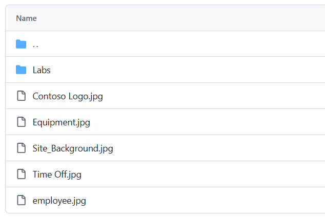

---
lab:
  title: "Задание\_0. Проверка лабораторной среды"
  module: 'Module 0: Course Introduction'
---

# Практическая лаборатория 0. Проверка лабораторной среды

> **ВАЖНО.** Эта лаборатория предоставляет вам клиент Microsoft 365 и лицензии для приложений Power Platform, которые вы будете использовать в этом курсе. Вы будете предоставлять только один клиент для лабораторий практики в этом курсе. Параметры и действия, выполняемые в этом клиенте, не выполняют откат или сброс, а виртуальная машина, предоставляемая вами, выполняет сброс при каждом закрытии сеанса лаборатории. Обратите внимание, что Microsoft 365 и Power Platform развиваются все время. Инструкции в этом документе могут отличаться от того, что вы увидите в своем клиенте. Кроме того, можно столкнуться с задержкой в несколько минут, прежде чем виртуальная машина будет подключена к сети для начала работы с лабораториями.

## Клиенты WWL — условия использования

Если вам предоставляется клиент в рамках учебной подготовки под руководством инструктора, обратите внимание, что клиент предоставляется с целью поддержки практических занятий в ходе обучения под руководством инструктора.

Клиенты не должны использоваться совместно или для целей, выходящих за рамки практических занятий. Клиент, используемый в этом курсе, является пробным клиентом, его нельзя использовать или получить к нему доступ после окончания курса, и он не подлежит продлению.

Клиентов нельзя переводить на платную подписку. Клиенты, полученные в рамках этого курса, остаются собственностью Корпорации Майкрософт, и мы оставляем за собой право в любое время получить к нему доступ и вернуть право владения.

## Упражнение 1. Доступ к Microsoft Power Platform

В этом упражнении вы убедитесь, что вы можете получить доступ к Power Apps.

### Задача 1.1. Вход в Power Apps

1. Убедитесь, что у вас под рукой ваши **учетные данные Microsoft 365** от авторизованного узла тестовой службы. Учетные данные будут находиться на вкладке **"Ресурсы** ".

1. Откройте новую вкладку браузера и перейдите по URL-адресу `https://powerapps.microsoft.com`

1. Выберите **Вход.**

1. Введите адрес электронной почты, предоставленный узлом авторизованной лаборатории.

1. Выберите **Далее**.

1. Введите пароль, предоставленный узлом авторизованной лаборатории.

1. Выберите **Вход.**

1. Вы можете выбрать **Да**, чтобы оставаться в системе.

1. Если появится запрос на вход в Microsoft Edge, нажмите кнопку ****"Нет", спасибо**.**

1. Если появится запрос на получение контактных данных, оставьте страну или регион в качестве значения по умолчанию и введите `0123456789` номер телефона и нажмите кнопку **"Отправить**".

1. В правом верхнем углу экрана убедитесь, что среда **** имеет значение **Dev One**. Здесь вы будете работать на всю работу этой лаборатории. Если это не так, выберите **среду Dev One** .

    

1. **Закройте область выбора среды**.

### Задача 1.2. Обновление браузера

Применение последних обновлений к браузеру предотвращает проблемы в следующей лаборатории при создании приложений.

1. Откройте **браузер Microsoft Edge** .

1. **Выберите команды (...) в правом верхнем углу браузера, выберите **"Справка" и "Отзывы**"** и выберите **"О Microsoft Edge**".

1. При необходимости примените обновления и перезапустите браузер.

## Упражнение 2. Скачивание изображений

1. Откройте окно браузера в клиенте и введите https://github.com/MicrosoftLearning/PL-900-Microsoft-Power-Platform-Fundamentals/tree/master/Allfiles.
1. На снимке экрана вы увидите изображения.

    

1. Откройте каждое **изображение отдельно и скачайте его, выбрав значок скачивания** .

    
