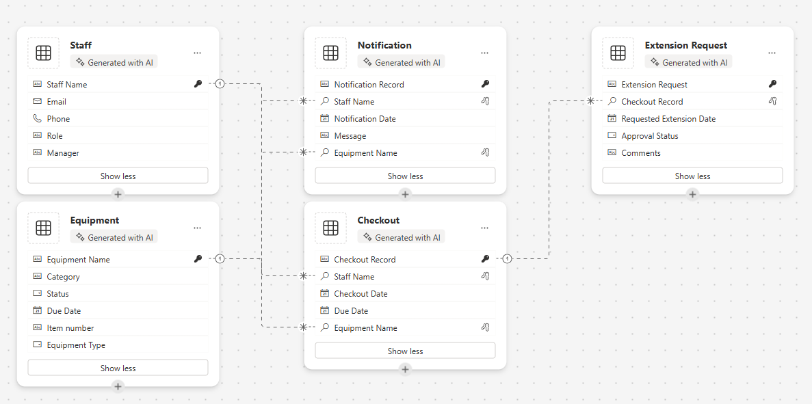
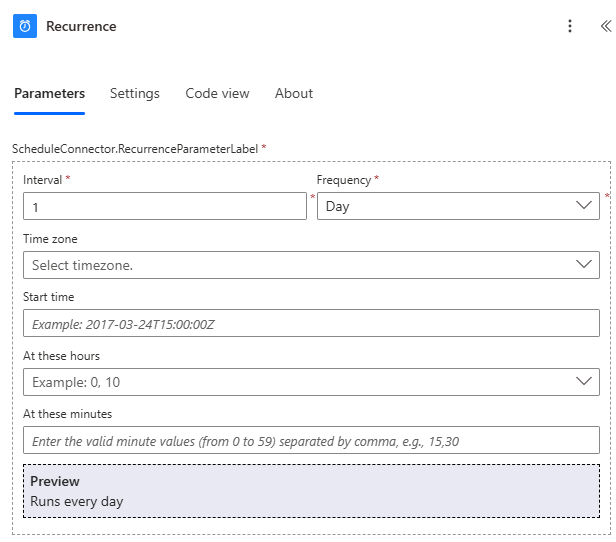
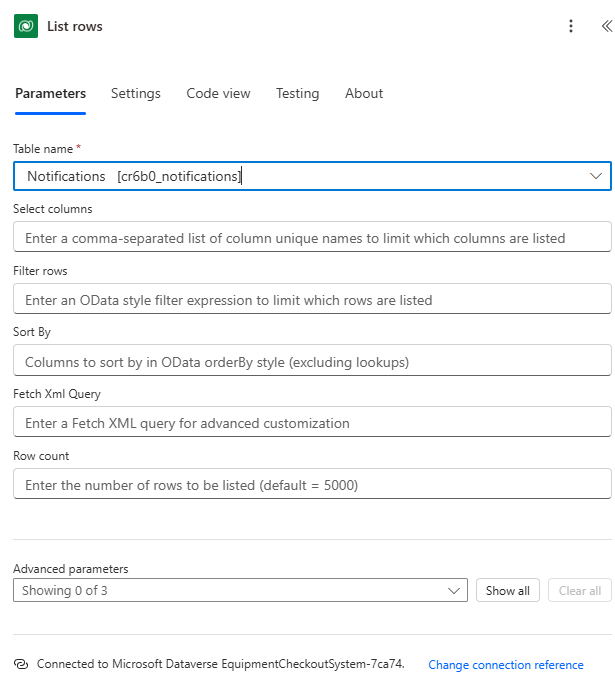

---
lab:
  title: Лаборатория 1. Создание решения с помощью конструктора планов
  learning path: 'Learning Path: Describe the business value of Microsoft Power Platform'
  module: 'Module 2: Describe the business value of extending business solutions by using Microsoft Power Platform'
---

## Цель обучения

В этом упражнении учащиеся будут использовать конструктор планов для создания полного, целевого бизнес-решения, которое может включать приложения, рабочие процессы, агенты и многое другое. Copilot поможет вам весь процесс создания решения.

После успешного завершения этой лаборатории вы будете:

- Используйте конструктор планов для создания решения.
- Используйте агент данных для создания модели данных.
- Используйте агент решения для создания необходимых компонентов.

### Сценарий

Contoso Consulting — это профессиональная организация услуг, специализирующаяся на ИТ и консультационных службах искусственного интеллекта. Так как они перешли на гибридную рабочую модель, многие сотрудники Компании Contoso работают из дома. Это приводит к проблемам, так как их сотрудники часто должны проверить оборудование.

Компания Contoso хотела бы использовать Power Platform для создания решения для управления проверкой и выходом оборудования.

В этом упражнении вы собираетесь использовать конструктор планов в Microsoft Power Platform для предоставления описания бизнес-задач, которые вы пытаетесь решить, и использовать рекомендации для создания решения

> [!IMPORTANT]
> В этой лаборатории используется ИИ для создания компонентов. Так как результаты ИИ могут отличаться, важно отметить, что результаты могут отличаться (но похожи на то, что определено в лаборатории). Основные понятия, описанные в лаборатории, будут одинаковыми независимо от того, что было создано или что оно было названо. Если предлагаемые или созданные объекты не соответствуют тому, что указано в инструкциях точно, вам может потребоваться внести корректировки в зависимости от того, что было создано для вас.*

### Время лаборатории

Предполагаемое время выполнения этого упражнения составляет **от 20 до 30** минут.

## Задача 1. Создание плана с помощью конструктора планов

**Использование конструктора планов**

1. Откройте портал Разработчика  Power Apps и перейдите на начальный **** экран.
2. В разделе " **Давайте сделаем план**", введите следующий текст: "*Мне нужен мой персонал, чтобы проверить оборудование и получать уведомления о дате* выполнения".

3. Нажмите кнопку **Перейти**.
4. Конструктор планов создаст план на основе предоставленного описания. План будет включать в себя следующее:
    - Бизнес-проблема
    - Назначение этого плана
    - Потребности пользователя

**Агент** "Требования" создал требования пользователей на основе предоставленного описания и должен рассматриваться как отправная точка для плана. При необходимости можно изменить требования.

5. Чтобы изменить требования, нажмите кнопку **"Изменить** ".
6. **В поле Copilot** в **разделе "Требования пользователей**" введите "*Сотрудники должны иметь возможность сообщать, если возникла проблема с оборудованием, пока они проверили* его".
7. Нажмите кнопку **Перейти**.

В план будет добавлено новое требование к отчетам о проблемах.

8. Когда вы удовлетворены требованиями по мере их перечисления, нажмите кнопку **"Сохранить** ".
9. Если вы удовлетворены требованиями, созданными агентом ****"Требования", выберите **"Выглядит хорошо**".

**Затем агент** модели данных помогает создать модель данных. В нем будут предложения по созданию таблиц для хранения данных для решения.

10.  Чтобы просмотреть сведения о модели, выберите **"Показать сведения**".

Все предлагаемые таблицы, столбцы и связи будут отображаться в конструкторе моделей данных. Панель Copilot можно использовать для внесения изменений в модель данных.

11.  **В области Copilot** справа от экрана введите следующее: "*Добавьте текстовый столбец в таблицу "Оборудование" с именем "Номер элемента".*
12.  После добавления **столбца в таблицу "Оборудование"** используйте **Copilot** , чтобы ввести следующие запросы по отдельности:
    - "Добавьте новый текстовый столбец в таблицу Staff/Employee с именем Manager".
    - "Добавьте новый столбец выбора в таблицу "Оборудование" с именем "Тип оборудования".
    - "Добавьте новый столбец выбора в таблицу "Оборудование" с именем "Тип оборудования". “

Модель данных должна выглядеть как указанная.

> [!NOTE]
> > Скорее всего, это не соответствует точно. И это нормально.

13.  С помощью навигации слева щелкните **значок обзора** . *(Расположено под стрелкой назад.)*
14.  В агенте **** данных выберите **"Выглядит хорошо**", чтобы перейти к следующему шагу.

**Далее агент** решения предоставит предложения для различных элементов. В нашем случае предполагается, что агент создает два приложения Canvas, поток Power Automate и агент. *(Ваш может отличаться)*

15.  В агенте **** решения нажмите кнопку **"Изменить**".
16.  **В поле Copilot** в разделе "Технология" введите следующее: *"Создайте агент для получения сведений об извлечении элементов для ответа на вопросы сотрудников".*
17.  Нажмите кнопку **Перейти**.
18.  **Будет добавлен агент** извлечений элементов. Нажмите кнопку **"Сохранить**".
19.  Если вы удовлетворены предложениями агента **решения, выберите **"Выглядит хорошо****".
20.  Выберите **"Сохранить таблицы"** для создания предлагаемой модели данных.

Конструктор планов создает файлы решений для всех создаваемых планов. Решение является критически важным компонентом управления жизненным циклом приложений (ALM).

21.  На экране " **Где нужно сохранить воры"** , задайте имя решения для системы проверки оборудования и нажмите **кнопку "Сохранить** ".

Для всех элементов, предлагаемых конструктором планов, может потребоваться от 1 до 3 минут. После сохранения сообщения, указывающего, что таблицы сохранены, выберите **X** , чтобы закрыть отображаемое сообщение.

## Задача 2. Создание и изменение приложений решения плана

Теперь, когда конструктор планов создал все необходимые таблицы и предоставил предложения для создания объектов, мы собираемся создать то, что было предложено. Начнем с создания приложения для проверки оборудования.

1.  Убедитесь, что у **вас открыт план** системы проверки оборудования.
2.  **В области "Обзор** плана" по-прежнему отображается кнопка сворачивания, чтобы обеспечить пространство конструктора в режиме. *(Находится в правом верхнем углу области обзора.)*
3.  **В окне конструктора** найдите **приложение** "Проверка оборудования" и нажмите кнопку **"Создать**". *(Power Apps быстро создаст приложение.)*

После создания приложения мы внесите в него несколько основных изменений. Прежде чем это сделать, давайте рассмотрим приложение.

4.  **Выберите экран** приветствия. *(Предоставляет быстрый доступ к таким элементам резервирования, извлечений и расширений.)*
5.  **Выберите экран "Резервировать сущности" и "Выноски**". *(Позволяет создавать новые, просматривать, изменять и удалять резервирования и извлечении.)*
6.  Перейдите к дополнительным экранам, таким как **запросы** и **уведомления** *расширений (или все экраны, созданные для вашего приложения).*
7.  **Выберите экран приветствия.**
8.  Выберите изображение над **объектами резервирования и извлечений.**
9.  В появившемся меню выберите **"Изменить **** \> стоковые** изображения".
10.  **В поле поиска** введите **оборудование**.
11.  Выберите один из предлагаемых изображений из списка и нажмите кнопку **"Вставить** ". *(***НЕОБЯЗАТЕЛЬНО:** *Повторите, как нужно для оставшихся изображений)*
12.  **Выберите описание** под текстом "Резервные сущности/ извлечение".
13. **На панели** команд нажмите кнопку **"Свойства**". *(Расположено справа от кнопки редактирования.)*
14. Измените **свойство Text** на": "Запуск нового или просмотр существующего резервирования".
15. **Выберите текст "Резервировать сущности/ вырезки"**,
16. Измените свойство Text на "Резервная техника".
17. **Выберите текст экрана** приветствия в верхней части экрана.
18. Измените свойство Text** на **"Contoso Equipment Checkout".
19. **В области "Свойства**" в разделе **"Стиль и тема**" измените цвет заливки на **темно-синий**. Выберите изображение над **персоналом**.

Экран** приветствия приложений **будет выглядеть следующим образом:

Дополнительные изменения можно вносить по мере необходимости, но на данный момент мы протестируем приложение.

20.  На панели команд выберите **значок воспроизведения** . (*Обратите внимание, что макет приложения изменится на основе размера* экрана)
21.  Выберите образ резервного **оборудования** .
22.  Чтобы отредактировать запись, выберите кнопку **Редактировать**.
23.  Измените **имя** записи.
24.  **Щелкните значок флажка**, чтобы сохранить изменения.
25.  Нажмите кнопку "Главная"**, **чтобы вернуться на **экран** приветствия.
26.  В правом верхнем углу приложения выберите **фиолетовый X** , чтобы вернуться в конструктор.
27.  **На панели** команд щелкните **значок "Сохранить**", чтобы сохранить приложение.
28.  Закройте вкладку "Браузер"**, **чтобы вернуться к планировщику **конструктора**. (*Обратите внимание, что кнопка в приложении изменилась с создания на редактирование.*)

> [[!NOTE]
> Если вы хотите повторить описанные выше действия, вы также можете создать и изменить приложение "Управление оборудованием".

## Задача 3. Создание предлагаемого потока

Помимо приложений, предлагаемых конструктором планов, также предлагается поток уведомлений напоминания. Далее мы создадим предлагаемый поток.

1.  **В окне конструктора **** найдите поток** уведомлений напоминания и нажмите кнопку **"Создать**". *(откроется конструктор потоков Power Automate)*
2.  Вы получите предлагаемый **поток**, нажмите кнопку **"Сохранить" и продолжить**.
3.  **На экране "Просмотр подключенных приложений и служб**" убедитесь, что все подключения имеют зеленый флажок и нажмите **кнопку "Создать поток**".

Созданный поток — это повторяющийся поток, который будет выполняться ежедневно, определять и выходить из них, и для каждого из них отправляется сообщение электронной почты лицу, который проверил элемент.

4.  **Выберите триггер повторения**.
5.  Обратите внимание, что триггер автоматически настроен на **интервал **** 1** и **частоту** дня. *(Можно также указать определенное время, когда он должен выполняться.)*

6.  **Выберите шаг "Список строк**".

На этом шаге вы увидите **таблицу уведомлений** , созданную в рамках модели данных, и определите все записи с **помощью DueDate** of **Today**.

7.  Если в **поле "Имя** таблицы" есть значение, удалите его.
8.  **В поле "Имя** таблицы" введите **уведомления** и выберите **уведомления [cX\#X\#_notifications]** или аналогичный именованный элемент в вашей среде.

9.  Выберите шаг **для каждого** шага.
10.  Для каждой записи, определенной на **шаге "Строки** списка", поток отправит сообщение электронной почты на адрес электронной почты сотрудника, который извлечен, чтобы напомнить им о том, что их элемент должен быть возвращен сегодня.

    
> [!IMPORTANT]
> Убедитесь, что на шаге электронной почты есть данные. Сбой включения данных приведет к ошибке. Если данные отсутствуют, заполните поля шага, чтобы соответствовать приведенному выше изображению. Вы можете ввести собственный адрес электронной почты в поле "To", если вы хотите.

Вы можете внести дополнительные изменения, которые вы видите в потоке. На данный момент мы оставим его так же, как это.

11.  **На панели** команд нажмите кнопку **"Сохранить черновик**".
12.  Нажмите кнопку **Опубликовать**.
13.  Закройте вкладку "Браузер"**, чтобы вернуться на **вкладку **конструктора планов**.
14.  Обратите внимание, **что поток** уведомлений напоминания теперь имеет значок редактирования** рядом **с ним.

## Задача 4. Создание агента извлечений элементов

Наконец, конструктор планов предоставил предложение для агента проверки элементов, который пользователи могут использовать для ответа на свои вопросы о резервированиях и многое другое.

1.  **В окне конструктора** **найдите агент** проверки элемента и нажмите кнопку **"Создать**". *(Copilot Studio откроется)*

    Студия Copilot добавит знания в агент на основе таблиц в решении. При необходимости можно добавить дополнительные знания. На сегодняшний день мы покинем агент как есть.

2.  **В области тестирования агента** введите следующее: *"Есть ли у Боба Джонсона просроченные элементы?"*
3.  Агент вернет ответ на основе данных в таблицах.

4.  В **Copilot Studio** нажмите кнопку **"Опубликовать** ".
5.  **На экране "Опубликовать этот агент"** нажмите **кнопку "Опубликовать**".
6.  Закройте вкладку "Браузер"**, чтобы вернуться в ****конструктор** планов.

## Задача 5. Сохранение плана

1.  В плане нажмите кнопку **"Сохранить** ", чтобы сохранить ее.
2.  После завершения сохранения нажмите **кнопку "Назад"** , чтобы вернуться на портал разработчика **Power Apps** .
3.  С помощью навигации слева выберите **"Планы**".
4.  Обратите внимание, **что в списке указан план системы** проверки оборудования.
5.  Выберите план "Система** проверки оборудования", **чтобы открыть резервную копию плана в редакторе.
