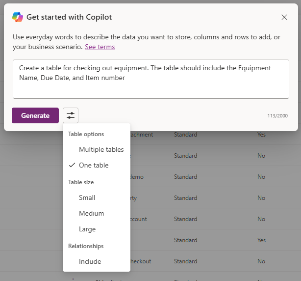

---
lab:
  title: Лаборатория 2. Создание модели данных
  learning path: 'Learning Path: Manage the Microsoft Power Platform environment'
  module: 'Module 1: Describe Microsoft Dataverse'
---

## Цель обучения

В этом упражнении учащиеся будут использовать Copilot для создания модели данных. Вы предоставите описание типа таблиц, которые вы хотите создать и использовать конструктор, чтобы внести изменения по мере необходимости, например добавить дополнительные столбцы.

После успешного завершения этой лаборатории вы будете:

- Используйте Copilot, чтобы помочь вам в создании модели данных.
- Добавление и изменение столбцов в таблицы.

### Сценарий

Contoso Consulting — это профессиональная организация услуг, специализирующаяся на ИТ и консультационных службах искусственного интеллекта. В течение года они предлагают множество различных мероприятий своим клиентам. Некоторые из них являются торговыми шоу событий стиля, где у них есть много партнеров, и предоставляют подробные сведения о новых продуктах, тенденциях рынка и услугах. Другие происходят в течение года и являются быстрыми вебинарами, которые используются для предоставления сведений об отдельных продуктах.

Компания Contoso хотела бы использовать Power Platform для создания решения для управления событиями, которые они могут использовать для управления различными событиями, которые они размещают в течение года. Кроме того, Компания Contoso стремится создать некоторые приложения для поддержки программы "Проверка оборудования сотрудников". 

В этом упражнении вы создадите режим данных, который будет использоваться для хранения различных типов событий, регистрации событий и других данных, необходимых компании Contoso для эффективного управления их событиями. Вы также создадите таблицу оборудования, которая будет использоваться в других приложениях.  

### Сведения о лаборатории

Перед началом этого упражнения рекомендуется выполнить следующее:

- **Лаборатория 1. Создание решения**

> **Важно.** Эта лаборатория использует ИИ для создания компонентов. Так как результаты ИИ могут отличаться, важно отметить, что результаты могут отличаться (но похожи на то, что определено в лаборатории). Основные понятия, описанные в лаборатории, будут одинаковыми независимо от того, что было создано или что оно было названо. Если таблицы и столбцы не совпадают точно, может потребоваться изменить параметры, созданные для вас.

### Время лаборатории

Предполагаемое время выполнения этого упражнения составляет **от 30 до 45** минут.

> **Примечание.** В предыдущей лаборатории мы создали решение для управления событиями и задайте его в качестве предпочтительного решения в этой среде. По этой причине нам не нужно напрямую переходить к решению для создания модели данных. Создаваемые элементы будут автоматически добавлены в решение.

> **Примечание.** Если при создании столбца выбора с помощью Copilot в таблице возникает **сообщение об ошибке "Необходимо внимание"** , можно создать столбец вручную, выполнив указанные ниже действия.
1. Выберите **параметры** представления, а затем выберите **"Просмотреть данные**". Структура таблицы станет видимой.
1. **Нажмите кнопку +Создать столбец, чтобы добавить новый столбец**.

## Задача 1. Создание модели данных

Компания Contoso в настоящее время хранит контактные данные донора в экземпляре Dataverse. Они хотели бы использовать Dataverse для отслеживания грантов, которые они обращаются за и пожертвования, которые они получают. Необходимо создать необходимые таблицы для поддержки будущих потребностей приложений Contoso.

1.  При необходимости откройте веб-браузер и перейдите на [портал Разработчика Power Apps](https://make.powerapps.com/) и войдите с помощью учетных данных учетной записи Майкрософт.
1.  На начальном экране Power Apps, используя навигацию слева, выберите **таблицы**.
1.  В разделе **"Таблицы"** выберите **"Начало работы с Copilot**".
1.  В разделе " **Описание таблиц, которые требуется** создать с помощью copilot", введите "*Создание таблицы для управления событиями. Таблица должна определить имя события, данные событий, расположение, максимальное количество участников и сведения о событии".*
1.  Рядом с кнопкой **"Создать** ", выберите **"Параметры** таблицы" и настройте следующее:
    - **Параметры таблицы:** одна таблица
    - Не **** включать связи.

    

1.  Нажмите кнопку **"Создать** ".

    > **Важно.** Copilot должен создавать **только одну** таблицу с именем **Events**. Если было создано больше, необходимо **удалить** их, указав Copilot имя таблицы для удаления. **Сбой удаления дополнительных таблиц будет влиять на следующий шаг.**

    

**Изменение модели данных с помощью Copilot**

Теперь, когда мы создали таблицу, мы добавим в нее дополнительные столбцы. Сначала мы добавим столбец типа события. Кроме того, контакты будут присутствовать на наших мероприятиях. Мы хотим добавить существующую таблицу Контактов в модель данных и связать ее с регистрацией событий позже.

7.  **В поле "Что нужно сделать?"** Введите следующее:*`Add a choice column named Event Type to Event table.`*
1.  Добавьте другой столбец, введя следующий текст: *`Add a choice column named Registration Required to Event table.`*

    

    > **Важно:** таблица событий не должна точно соответствовать приведенному выше изображению, но она должна иметь по крайней мере следующие столбцы:
    - Имя события
    - Дата события
    - Максимальное число участников
    - Расположение
    - Тип события
    - Требуется регистрация.

    Если у вас нет всех указанных выше столбцов, используйте Copilot, чтобы добавить их в модель данных.  

    Затем добавим таблицу **Contact** в модель данных.

1.  В верхней строке **** команд выберите **+Существующая таблица.**
1.  **В поле поиска** введите **"Контакт"** и нажмите кнопку **"Добавить выбранный**".

    В зависимости от типа события может быть один или несколько сеансов. Чтобы управлять различными сеансами, необходимо определить, что такое сеанс, и событие, с которым оно связано. Далее мы будем использовать Copilot для создания таблицы сеансов событий.

1.  **В поле "Что нужно сделать?"** Введите следующее:*`Add a new table called Event Session. `*

    Copilot, скорее всего, создаст две таблицы, сеанс событий и динамик событий. Так как наши контакты будут докладчиками, мы удалим таблицу докладчика событий.

1.  При необходимости в **поле "Что хотите сделать" введите** : *`Remove the Event Speaker table.`*
1.  В Copilot введите следующий текст: *`Add a new text column to the Event Session table called Session Description.`*

    

    Затем мы добавим одну последнюю таблицу с именем **"Регистрация сеансов**". Эта таблица будет использоваться для управления пользователями, которые регистрируются для определенных сеансов.

1.  В Copilot введите следующий текст: *`Add a new table called Session Registrations.`*

    Copilot, скорее всего, создаст две таблицы, регистрацию сеансов, сеанс или участник (или что-то другое). Так как наши контакты могут быть участниками, мы удалим таблицу участников. Если были созданы другие таблицы (например, сеанс или что-то другое), отличные от регистрации сеансов, удалите их.

1.  При необходимости в Copilot введите следующий текст: *`Remove the Participant table.`*
    
    Иногда столбец "Имя участника" добавляется в таблицу регистрации сеанса. Мы должны удалить его, так как это может привести к проблемам позже при попытке сохранить модель данных. (Мы заменим его другим столбцом участника позже.)  

1.  При необходимости в Copilot введите следующий текст: *`Remove the Participant Name column from the Session Registration table.`*

1.  Если у вас есть поле "Основной столбец", введите следующий текст: *`Rename the Primary Column to Registration Name in Session Registration table.`*

1.  В Copilot введите следующий текст: *`Add a text column to the Session registration table called Special Instructions.`*

    Заполненная таблица регистрации сеансов должна выглядеть следующим образом:

    

    > **Важно,** хотя в вашей организации нет необходимости точно соответствовать, важно, чтобы у вас не было столбца с именем "Участник", и что у вас есть по крайней мере следующее:
    - Имя регистрации
    - Дата сеанса
    - Особые инструкции

    Теперь мы создадим связи между различными таблицами. Так как записи контактов могут быть докладчиками в сеансах, мы создадим связь между таблицами контактов и сеансов событий.

1.  На панели команд выберите **"Создать связи**".
1.  Настройте связь следующим образом:
    - **Тип связи:** "один ко многим"
    - **Один из них:** контакт
    - **Многие:** сеанс событий
    - **Отображаемое имя**: `Speaker`
1.  Нажмите кнопку **Готово**.

    

    Так как контакты могут быть зарегистрированы для сеансов в сеансах, мы создадим связь между таблицами регистрации контактов и сеансов.

1.  **На панели** команд выберите **"Создать связи**".
1.  Настройте связь следующим образом:
    - **Тип связи:** "один ко многим"
    - **Один из них:** контакт
    - **Многие:** регистрация сеанса
    - **Отображаемое имя**: `Participant`

    

1.  Нажмите кнопку **Готово**.

    Одно событие может иметь несколько сеансов, поэтому мы создадим связь между таблицами событий и сеансов событий.

1.  **На панели** команд выберите **"Создать связи**".
1.  Настройте связь следующим образом:
    - **Тип связи:** "один ко многим"
    - **Одно:** событие
    - **Многие:** сеанс событий
    - **Отображаемое имя**: `Event`

    

1. Нажмите кнопку **Готово**.

    Наконец, участники регистрируются для сеансов событий, поэтому нам потребуется создать связь между сеансами событий и таблицами регистрации сеансов.

1.  **На панели** команд выберите **"Создать связи**".
1.  Настройте связь следующим образом:
    - **Тип связи:** "один ко многим"
    - **Один из них:** сеанс событий
    - **Многие:** регистрация сеансов
    - **Отображаемое имя**: `Event Session`

    

1.  Нажмите кнопку **Готово**.

    Созданная модель данных должна выглядеть следующим образом:

    

1.  Нажмите кнопку **"Сохранить и выйти".**

## Задача 2. Изменение таблиц и столбцов напрямую

Copilot — это замечательный способ создания таблиц и столбцов очень быстро. Однако иногда может потребоваться внести изменения в таблицы и столбцы напрямую. Например, в этой задаче мы будем обновлять некоторые существующие столбцы, а также отслеживать количество участников, зарегистрированных для определенного сеанса.

1.  При необходимости откройте веб-браузер и перейдите на [портал Разработчика Power Apps](https://make.powerapps.com/) и войдите с помощью учетных данных учетной записи Майкрософт.
1.  На панели навигации слева выберите **Таблицы**.
1.  **В поле поиска** введите **событие**.
1.  Откройте таблицу **событий** .
1.  В заголовке **схемы** выберите **"Столбцы**".
1.  Найдите и откройте **столбец типа** события.
1.  Замените метки следующими:
    - Конференция
    - Выставка-ярмарка
    - Вебинар
    - Обед и обучение
    - Launch
1.  **Задайте для выбора по умолчанию значение** **None**.

    

1.  Выберите кнопку **Сохранить**. (*Если столбец не удается сохранить, в первый раз повторите попытку.*)

    Далее мы добавим новый столбец в **таблицу сеансов** событий, чтобы отслеживать общее количество регистраций сеансов.

1.  С помощью навигации слева выберите **таблицы** , чтобы оставить таблицу **событий** .
1.  **В поле поиска** введите **событие**.
1.  Откройте таблицу сеансов **** событий.
1.  В заголовке **схемы** выберите **"Столбцы**".
1.  На панели команд нажмите кнопку **"Создать столбец** ".
1.  Настройте новый столбец следующим образом:
    - **Отображаемое имя**: `Total Registrations`
    - **Тип данных:** целое число
    - **Поведение**: свертка

    

1.  Нажмите кнопку **"Сохранить и изменить**".

    > **Важно.** Если вы включили блокировщик всплывающих окон, может потребоваться отключить его для отображения поля свертки.

1.  Настройте столбец свертки следующим образом:
    - В разделе **"Связанная сущность"** выберите **"Добавить связанную сущность**".
    - Выберите таблицу регистрации** сеансов**.
    - Нажмите кнопку **"Сохранить изменения** " (*флажок*)
    - В разделе **"Агрегирование" выберите **"Добавить агрегирование****".
    - В разделе **"Агрегатная функция"** выберите **"Число**".
    - Для **поля "Агрегированная связанная сущность"** выберите **"Регистрация** сеанса".
    - Нажмите кнопку **"Сохранить изменения** " (флажок *)*

    

1.  Нажмите кнопку **Сохранить и закрыть**.

    Теперь вы успешно создали модель данных, которая будет использоваться для поддержки приложения управления событиями. 

## Задача 3. Создание таблицы оборудования

Помимо управления событиями, компания Contoso имеет программу получения сотрудников.  Затем мы создадим таблицу для хранения оборудования. 
1.  На панели навигации слева выберите **Таблицы**.
1.  В разделе **"Таблицы"** выберите **"Начало работы с Copilot".**
1.  В разделе " **Описание таблиц, которые требуется** создать Copilot", введите следующее: *`Create a table for checking out equipment. The table should include the Equipment Name, Due Date, and Item number.`*
1.  Рядом с кнопкой **"Создать** ", выберите **"Параметры** таблицы" и настройте следующее:
    - **Параметры таблицы:** одна таблица
    - Не **** включать связи.

    

1. Нажмите кнопку **"Создать** ".

    > **Важно:** Copilot должен создать только одну таблицу с именем **Checkout Equipment**. Если было создано больше, их можно удалить, указав Copilot имя таблицы для удаления.

**Изменение модели данных с помощью Copilot**

Теперь, когда мы создали таблицу, мы добавим в нее дополнительные столбцы. Сначала мы добавим столбец типа события. Кроме того, контакты будут присутствовать на наших мероприятиях. Мы хотим добавить существующую таблицу Контактов в модель данных и связать ее с регистрацией событий позже.

6.  **В поле "Что нужно сделать?"** Введите следующее:*`Rename the table to Equipment.`*
1.  **В поле "Что нужно сделать?"** Введите следующее:*`Add a choice column named Equipment type.`*
1.  Добавьте другой столбец, введя следующий текст: *`Add a text column named Category.`*
1.  Добавьте другой столбец, введя следующий текст: *`Add a text column named Status.`*

    Завершенная таблица должна выглядеть следующим образом:

    

1.  Если таблица содержит дополнительные столбцы, удалите эти столбцы, введя их. *`Delete the [column name] column.`*
1.  Когда таблица соответствует изображению, нажмите кнопку **"Сохранить и выйти**".

## Задача 4. Изменение таблицы оборудования напрямую

1.  При необходимости откройте веб-браузер и перейдите на портал Разработчика Power Apps и войдите с помощью учетных данных учетной записи Майкрософт.
1.  На панели навигации слева выберите **Таблицы**.
1.  В поле "Поиск **" **введите **"Оборудование".**
1.  Откройте таблицу **"Оборудование** ".
1.  В заголовке **схемы** выберите **"Столбцы".**
1.  Найдите и откройте **столбец "Тип** оборудования".
1.  При необходимости замените метки следующими:
    - Электроника
    - Мебель
    - Инструменты
    - Аксессуары
1.  **Задайте для выбора по умолчанию значение** **None.**

    

1.  Выберите кнопку Сохранить. (Если столбец не удается сохранить, в первый раз повторите попытку.)

Поздравляем, вы успешно создали модель данных в Microsoft Dataverse.

