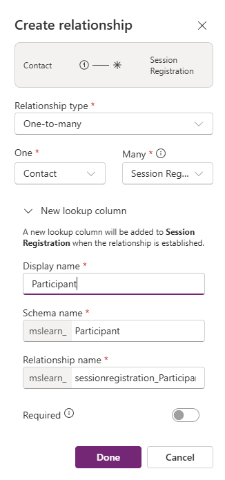

---
lab:
  title: Лаборатория 2. Создание модели данных
  learning path: 'Learning Path: Manage the Microsoft Power Platform environment'
  module: 'Module 1: Describe Microsoft Dataverse'
---

## Цель обучения

В этом упражнении учащиеся будут использовать Copilot для создания модели данных. Вы предоставите описание типа таблиц, которые вы хотите создать и использовать конструктор, чтобы внести изменения по мере необходимости, например добавить дополнительные столбцы.

После успешного завершения этой лаборатории вы будете:

- Используйте Copilot, чтобы помочь вам в создании модели данных.
- Добавление и изменение столбцов в таблицы.

### Сценарий

Contoso Consulting — это профессиональная организация услуг, специализирующаяся на ИТ и консультационных службах искусственного интеллекта. В течение года они предлагают множество различных мероприятий своим клиентам. Некоторые из них являются торговыми шоу событий стиля, где у них есть много партнеров, и предоставляют подробные сведения о новых продуктах, тенденциях рынка и услугах. Другие происходят в течение года и являются быстрыми вебинарами, которые используются для предоставления сведений об отдельных продуктах.

Компания Contoso хотела бы использовать Power Platform для создания решения для управления событиями, которые они могут использовать для управления различными событиями, которые они размещают в течение года.

В этом упражнении вы создадите режим данных, который будет использоваться для хранения различных типов событий, регистрации событий и других данных, необходимых компании Contoso для эффективного управления их событиями.

### Сведения о лаборатории

Перед началом этого упражнения рекомендуется выполнить следующее:

- **Лаборатория 2. Создание решения Power Platform**

> [!IMPORTANT]
> В этой лаборатории используется ИИ для создания компонентов. Так как результаты ИИ могут отличаться, важно отметить, что результаты могут отличаться (но похожи на то, что определено в лаборатории). Основные понятия, описанные в лаборатории, будут одинаковыми независимо от того, что было создано или что оно было названо. Если таблицы и столбцы не совпадают точно, может потребоваться изменить параметры, созданные для вас.

### Время лаборатории

Предполагаемое время выполнения этого упражнения составляет **от 20 до 30** минут.

> [!NOTE]
> В предыдущей лаборатории мы создали решение для управления событиями и задайте его в качестве предпочтительного решения в этой среде. По этой причине нам не нужно напрямую переходить к решению для создания модели данных. Создаваемые элементы будут автоматически добавлены в решение.

## Задача 1. Создание модели данных

Компания Contoso в настоящее время хранит контактные данные о донере в экземпляре Dataverse. Они хотели бы использовать Dataverse для отслеживания грантов, которые они обращаются за и пожертвования, которые они получают. Необходимо создать необходимые таблицы для поддержки будущих потребностей приложений Contoso.

1.  При необходимости откройте веб-браузер и перейдите на [портал Разработчика Power Apps](https://make.powerapps.com/) и войдите с помощью учетных данных учетной записи Майкрософт.
2.  На панели навигации слева выберите **Таблицы**.
3.  В разделе **"Таблицы**" выберите **"Начало работы с Copilot**".
4.  В разделе " **Описание таблиц, которые требуется** создать с помощью copilot", введите "*Создание таблицы для управления событиями. Таблица должна определить имя события, данные события, максимальное количество участников и сведения о событии".*
5.  Рядом с кнопкой **"Создать** ", выберите **"Параметры** таблицы" и настройте следующее:
    - **Параметры таблицы:** одна таблица
    - Не **** включать связи.

6.  Нажмите кнопку **"Создать** ".

> [!IMPORTANT]
> Copilot должен создать только одну таблицу с именем Events. Если было создано больше, их можно удалить, указав Copilot имя таблицы для удаления.

**Изменение модели данных с помощью Copilot**

Теперь, когда мы создали таблицу, мы добавим в нее дополнительные столбцы. Сначала мы добавим столбец типа события. Кроме того, контакты будут присутствовать на наших мероприятиях. Мы хотим добавить существующую таблицу Контактов в модель данных и связать ее с регистрацией событий позже.

1.  **В поле "Что нужно сделать nex**t", введите "*Добавить столбец выбора с именем типа события".*
2.  Добавьте другой столбец, введя следующий текст: "*Добавить столбец выбора с именем регистрации*"

Затем добавьте таблицу **Contact** в модель данных.

3.  В верхней строке **** команд выберите **+Существующая таблица.**
4.  **В поле поиска** введите **"Контакт"** и нажмите кнопку **"Добавить".**

В зависимости от типа события может быть один или несколько сеансов. Чтобы управлять различными сеансами, необходимо определить, что такое сеанс, и событие, с которым оно связано. Далее мы будем использовать Copilot для создания таблицы сеансов событий.

5.  В поле **"Что хотите сделать"** введите "*Добавить новую таблицу с именем сеанса событий".*

Copilot, скорее всего, создаст две таблицы, сеанс событий и динамик событий. Так как наши контакты будут докладчиками, мы удалим таблицу докладчика событий.

6.  При необходимости в поле **"Что хотите сделать"** введите "*Удалить таблицу докладчика событий".*
7.  В Copilot введите следующий текст: "*Добавьте новый текстовый столбец в таблицу сеансов событий под названием описание сеанса".*

Затем мы добавим одну последнюю таблицу с именем "Регистрация сеансов", эта таблица будет использоваться для управления отдельными лицами, которые регистрируются для определенных сеансов.

8.  В Copilot введите следующий текст: *"Добавление новой таблицы с именем регистрации сеансов".*

    Copilot, скорее всего, создаст две таблицы, регистрацию сеансов, сеанс или участника. Так как наши контакты могут быть участниками, мы удалим таблицу участников. Если были созданы другие таблицы (например, сеансы), отличные от регистрации сеансов, удалите их.

9.  В Copilot введите следующий текст: "*Удалить таблицу участника".*
10.  В Copilot введите следующий текст: "*Добавьте текстовый столбец в таблицу регистрации сеансов с именем специальных инструкций".*

Теперь мы создадим связи между различными таблицами. Так как записи контактов могут быть докладчиками в сеансах, мы создадим связь между таблицами контактов и сеансов событий.

11.  На панели команд выберите **"Создать связи**".
12.  Настройте связь следующим образом:
    - **Тип связи:** "один ко многим"
    - **Один из них:** контакт
    - **Многие:** сеанс событий
    - **Отображаемое имя:** динамик
13.  Нажмите кнопку **Готово**.

Так как контакты могут быть зарегистрированы для сеансов в сеансах, мы создадим связь между таблицами регистрации контактов и сеансов.

14.  **На панели** команд выберите **"Создать связи**".
15.  Настройте связь следующим образом:
    - **Тип связи:** "один ко многим"
    - **Один из них:** контакт
    - **Многие:** регистрация сеанса
    - **Отображаемое имя:** участник

16.  Нажмите кнопку **Готово**.

Одно событие может иметь несколько сеансов, поэтому мы создадим связь между таблицами событий и сеансов событий.

17.  **На панели** команд выберите **"Создать связи**".
18.  Настройте связь следующим образом:
    - **Тип связи:** "один ко многим"
    - **Одно:** событие
    - **Многие:** сеанс событий
    - **Отображаемое имя:** событие

Наконец, участники регистрируются для сеансов событий, поэтому необходимо создать связь между сеансами событий и таблицами регистрации сеансов.

19.  **На панели** команд выберите **"Создать связи**".
20.  Настройте связь следующим образом:
    - **Тип связи:** "один ко многим"
    - **Один из них:** сеанс событий
    - **Многие:** регистрация сеансов
    - **Отображаемое имя:** сеанс событий

21.  Нажмите кнопку **Готово**.

Созданная модель данных должна выглядеть следующим образом:

22.  Нажмите кнопку **"Сохранить и выйти".**

## Задача 2. Изменение таблиц и столбцов напрямую

Copilot — это замечательный способ создания таблиц и столбцов очень быстро. Однако иногда может потребоваться внести изменения в таблицы и столбцы напрямую. Например, в этой задаче мы будем обновлять некоторые существующие столбцы, а также отслеживать количество участников, зарегистрированных для определенного сеанса.

1.  При необходимости откройте веб-браузер и перейдите на [портал Разработчика Power Apps](https://make.powerapps.com/) и войдите с помощью учетных данных учетной записи Майкрософт.
2.  На панели навигации слева выберите **Таблицы**.
3.  **В поле поиска** введите **событие**.
4.  Откройте таблицу **событий** .
5.  В заголовке **схемы** выберите **"Столбцы**".
6.  Найдите и откройте **столбец типа** события.
7.  Замените метки следующими:
    - Конференция
    - Вебинар
    - Обед и обучение
    - Launch
8.  **Задайте для выбора по умолчанию значение** **None**.

9.  Выберите кнопку **Сохранить**. (*Если столбец не удается сохранить, в первый раз повторите попытку.*)

Далее мы добавим новый столбец в **таблицу сеансов** событий, чтобы отслеживать общее количество регистраций сеансов.

10.  На панели навигации слева выберите **Таблицы**.
11.  **В поле поиска** введите **событие**.
12.  Откройте таблицу сеансов **** событий.
13.  В заголовке **схемы** выберите **"Столбцы**".
14.  На панели команд нажмите кнопку **"Создать столбец** ".
15.  Настройте новый столбец следующим образом:
    - **Отображаемое имя:** общее количество регистраций
    - **Тип данных:** целое число
    - **Поведение**: свертка

16.  Нажмите кнопку **"Сохранить и изменить**".

> [!IMPORTANT]
> Если вы включили блокировщик всплывающих окон, может потребоваться отключить его для отображения поля свертки.

17.  Настройте столбец свертки следующим образом:
    - В разделе **"Связанная сущность"** выберите **"Добавить связанную сущность**".
    - Выберите таблицу регистрации** сеансов**.
    - Нажмите кнопку **"Сохранить изменения** " (*флажок*)
    - В разделе **"Агрегирование" выберите **"Добавить агрегирование****".
    - В разделе **"Агрегатная функция"** выберите **"Число**".
    - В **поле "Агрегированная связанная сущность"** выберите **"Регистрация** сеанса".
    - Нажмите кнопку **"Сохранить изменения** " (флажок *)*

18.  Нажмите кнопку **Сохранить и закрыть**.

Теперь вы успешно создали таблицы и столбцы в Microsoft Dataverse с помощью Copilot.
