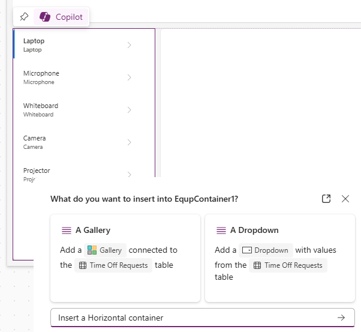

---
lab:
  title: Лаборатория 3. Создание приложения на основе холста
  learning path: 'Learning Path: Demonstrate the capabilities of Microsoft Power Apps'
  module: 'Module 2: Build a canvas app'
---
## Цель обучения

В этом упражнении вы будете использовать Copilot для создания приложения холста, которое сотрудники могут использовать для запроса времени ожидания и управления запросами на получение оборудования. После создания приложения вы будете использовать конструктор Copilot и Power Apps для изменения приложения.

После успешного завершения этой лаборатории вы будете:

- Используйте Copilot, чтобы помочь вам в создании модели данных для поддержки приложения.
- Изменение приложения холста.

### Сценарий

Contoso Consulting — это профессиональная организация услуг, специализирующаяся на ИТ и консультационных службах искусственного интеллекта. Они хотят создать приложение времени ожидания, которое сотрудники могут использовать для запроса времени ожидания.

### Сведения о лаборатории

Перед началом этого упражнения необходимо выполнить следующую лабораторию:

- **Лаборатория 2. Создание модели данных**

> **Важно, чтобы** использовать ИИ для создания компонентов. Так как результаты ИИ могут отличаться, важно отметить, что результаты могут отличаться (но похожи на то, что определено в лаборатории). Основные понятия, описанные в лаборатории, будут одинаковыми независимо от того, что было создано или что оно было названо. Если таблицы и столбцы не совпадают точно, может потребоваться изменить параметры, созданные для вас.

Предполагаемое время выполнения этого упражнения составляет **60–75** минут.

## Задача 1. Вход в Power Apps и изучение интерфейса

1.  Откройте веб-браузер и перейдите на портал Разработчика [Power Apps](https://make.powerapps.com/) .
1.  С помощью навигации слева нажмите кнопку **"Создать**".
1.  В разделе **"Создание приложений**" выберите **"Начать с Copilot**".
1.  В разделе " **Описание таблиц" для создания** экрана сборки copilot введите следующее: *` I want to store time off requests sent by employees. The table should identify the start and end times of the request.`*
1.  Нажмите кнопку " **Параметры** таблицы". В появившемся меню выберите **одну таблицу**.

    

1.  Нажмите кнопку **"Создать** ".

    Copilot должен создать таблицу **"Время ожидания запроса** ". Далее мы добавим в таблицу дополнительные столбцы.

    **Примечание.** При необходимости добавьте имя таблицы в запрос.

1.  **В области Copilot** введите:*`Add a choice column called Time Off Reason.`*
1.  **В области Copilot** отдельно добавьте следующие запросы.
    - *`Add a choice column named Time off Type.`*
    - *`Add a Date column called Submission Date.`*
    - *`Add a choice column to the Time Off request table called Approval Status.`*
    - *`Add a multi-line text column called Request Details.`*

    Таблица выключения должна выглядеть следующим образом:

    

    Затем мы добавим таблицу пользователей в модель данных, чтобы связать запросы времени с конкретными пользователями.

1.  **На панели** команд выберите **+Существующая таблица**.
1.  Переключение с **recommeded** на **все таблицы**.
1.  **В поле поиска** введите **пользователя**.
1.  **Выберите таблицу "Пользователь"** и нажмите кнопку "Добавить выбранный****".
1.  **На панели** команд выберите **"Создать связи**".
1.  Настройте связь следующим образом:

    -   **Один из них:** пользователь
    -   **Многие:** запрос времени ожидания
    -   **Отображаемое имя**: `Requesting Employee`
  
1.  Нажмите кнопку **Готово**.

    Завершенная модель данных должна выглядеть следующим образом:

    

1.  Нажмите кнопку **"Сохранить и открыть приложение** ".

> [!NOTE]
> Создание нового приложения может занять несколько минут.

## Задача 2. Персонализация нового приложения

Теперь, когда новое приложение было создано, мы будем вносить некоторые изменения в него в соответствии с нашими потребностями. Начнем с внесения некоторых изменений на экран приветствия.

1.  Открыв новое приложение, выберите заполнитель изображения над текстом ****"Отключать запросы**".**
1.  В появившемся меню выберите **"Изменить **** \> отправку".**
1.  **Выберите изображение "Отключено**" в папке файлов классов и нажмите кнопку **"Открыть**".
1.  Затем выберите **заполнитель изображения** над **пользователями**.
1.  В появившемся меню выберите **"Изменить **** \> отправку".**
1.  **Выберите изображение "Сотрудник"** в папке файлов классов и нажмите кнопку **"Открыть**".

    Затем мы изменим размер изображений, чтобы упростить чтение пользователями. Кроме того, мы будем настраивать текст, отображаемый для каждого элемента.

1.  **На панели** команд нажмите кнопку **"Свойства**". (*Расположено справа от кнопки редактирования.*)
1.  Выберите изображение времени отключения **, который вы добавили **ранее.
1.  **На панели "Свойства"** настройте изображение следующим образом:
    
    -   **Положение изображения:** заливка
    -   **Ширина:** 300
    -   **Высота:** 300
      
1.  Повторите предыдущий шаг, чтобы задать **высоту** и **ширину **** изображения Employee** значение **300** x **300**.
1.  Выберите текст ниже **"Запросы** на выключение".
1.  На панели "Свойства"** выберите **** текстовое **поле и измените текст следующим образом:*`Create, View, and Manage you time off requests.`*
1.  **Выберите текст экрана** приветствия в заголовке****.
1.  **В области "Свойства"** справа выберите **поле "Логотип**".
1.  В появившемся меню выберите " **Отправить**".
1. **Выберите логотип** Contoso из файлов класса и нажмите кнопку **"Открыть**".
1. **На панели "Свойства**" в **группе стилей** и тем выберите **значок цвета заливки**.
1. Выберите вкладку "Настраиваемый****"
1. Измените шестнадцатеричный** цвет на**:`101E2B`
1. Убедитесь, что вы по-прежнему **выбрали заголовок** и измените **заголовок** `Contoso Employee Hub`на .
1. **На панели команд** нажмите **кнопку "Сохранить**", чтобы сохранить приложение.
1. **На экране "Сохранить**" задайте **для параметра "Имя**`Contoso Employee Hub`" и нажмите кнопку **"Сохранить".**

    Ваше приложение будет выглядеть как изображение.

    

## Задача 3. Добавление нового экрана в приложение.

Как вы создаете приложение, один из ваших менеджеров обращается к вам и интересуется, могут ли сотрудники также использовать это приложение для проверки оборудования. Компания Contoso уже хранит сведения о извлечении оборудования в Dataverse, поэтому это просто вопрос о том, чтобы сделать информацию доступной в приложении.

1.  Если приложение по-прежнему открыто, разверните **область Copilot** (при необходимости). В Copilot введите следующее: *`Add a new screen called Equipment Checkout.`*
1.  Выберите **Отправить**.
1.  Нажмите кнопку "Сохранить"**, **чтобы принять экран.
1.  В приложение добавляется новый экран с именем **"Проверка** оборудования".
1.  **На экране "Проверка** оборудования" нажмите кнопку **"С макетом**" и выберите макет боковой **панели**.
1.  Разверните различные контейнеры до тех пор, пока **Не будет отображаться SideBarContainer** .

    

1.  Щелкните правой кнопкой мыши SidebarContainer и переименуйте **его в **EquipContainer1****.
1.  **Выбрав контейнер EquipContainer1**, нажмите кнопку **"Открыть меню** вставки".
1.  **В окне поиска** введите **коллекцию** и выберите **"Вертикальная коллекция**".
1.  При запросе troi укажите источник данных в **появившемся поле поиска**, введите **оборудование** и выберите таблицу **"Оборудование".**
1. В **представлении** дерева слева от экрана выберите **элемент управления Gallery1** , который вы только что добавили.
1. Щелкните правой кнопкой мыши имя коллекции, выберите **"Переименовать**" и переименуйте в `Equipment List`.
1. Наведите указатель мыши на **коллекцию "Список** оборудования" на панели инструментов, которая отображается над коллекцией, выберите **"Макет**".
1. Выберите параметр макета** заголовка **и субтитров.
1. **Выбрав коллекцию "Список** оборудования", на **панели "Свойства**" настройте следующее:

    -   **Width**: `360`
    -   **Гибкая высота:** вкл.
    -   **Минимальная высота:** `287`

    Затем мы добавим дополнительный контейнер в **контейнер EquipmentContiner1** для хранения элемента управления поиска, который будет использоваться для фильтрации содержимого **коллекции "Список** оборудования".

1.  В **представлении "Дерево** " выберите **EquipContainer1**.
1.  Наведите указатель мыши на контейнер и выберите **значок Copilot** .
1.  Введите следующий текст: *`Insert a Horizontal container.`*

    

1.  Нажмите кнопку **"Сохранить".**
1.  Новый контейнер будет добавлен в нижней части **контейнера EquipContainer1** .
1.  В представлении **** дерева щелкните, удерживайте и перетащите новый контейнер и поместите его над коллекцией списков **** оборудования.
1.  Переименуйте контейнер `EquipSearchContainer`в .
1.  В области "Свойства" **выбран **параметр EquipSearchContainer**,** настройте следующее:
    
    -   **Минимальная ширина:** `0`
    -   **Гибкая высота: выкл.**
    -   **Height**: `44`
    
1.  При **выборе EquipSearchContainer** нажмите кнопку **"Открыть меню** вставки".
1. **В поле поиска** введите **текст** и выберите **ввод** текста.
1. Переименуйте **поле ввода** текста в `EquipSearchInput`.
1. С **выбранным параметром **EquipSearchInput** в области "Свойства**" настройте следующим образом:

    -   **По умолчанию:** пустое (ничего)
    -   **Текст подсказки:** поиск
    -   **Шрифт:** Open Sans
    -   **Размер шрифта:** 14
    -   **Заполнение** (приведенные ниже значения уже могут быть там.)
        -   **Начало:** 5
        -   **Нижнее:** 5
        -   **Слева:** 12
        -   **Справа:** 5
    -   **Высота:** 44
    -   **Гибкая ширина: вкл.**
    -   **Минимальная ширина:** 0

        

1. В **представлении**** дерева выберите Файл EquipSearchContainer.**
1. Наведите указатель мыши на контейнер, выберите **значок Copilot** и введите *`Add a Search Icon.`*
1. Нажмите кнопку **"Сохранить".**

    > **Примечание.** Если Copilot произошло, чтобы добавить неправильный значок, удалите его и вставьте лупы вручную.

1. **Выбрав значок поиска**, в **области "Свойства**" настройте элемент управления следующим образом:

    -   **Набивочный материал**
        -   **Начало:** 10
        -   **Боттон:** 10
        -   **Слева:** 10
        -   **Справа:** 10
    -   **Высота:** 44
    -   **Ширина:** 44

    

1. В представлении **** "Дерево" слева выберите **Файл EquipSearchContainer.**

    Наконец, мы настроим **коллекцию "Список** оборудования" для заполнения данных на основе текста, введенного в поле управления поиском.

1.  Выберите созданную ранее коллекцию **"Список** оборудования".
1.  В свойстве **Items** введите следующую формулу: `Search([@'Equipments'], EquipSearchInput.Text, 'Equipment Name',Category)`

    

1. **На панели команд** нажмите **кнопку "Сохранить**", чтобы сохранить приложение.

> **Важно.** Если вы копировали и вставили формулу в строку формул, возможно, что значение '' неверно для имени оборудования и оборудования. Если вы получаете ошибку формулы, попробуйте удалить и повторно выполнить их.

## Задача 4. Создание контейнера для отображения операций записи.

Когда пользователь выбирает запись в списке оборудования, мы хотим открыть запись в другом контейнере, чтобы разрешить им изменять выбранную запись.

1.  **Выберите MainContainer** и переименуйте его `DetailsContainer`в .
1.  **В detailsContainer** нажмите кнопку **"Вставить**".
1.  В поле "Поиск **" введите **контейнер** и выберите **"Вертикальный **контейнер**".
1.  Щелкните правой кнопкой мыши и **переименуйте** контейнер `RecordDetails`в .
1.  В контейнере **RecordDetails** нажмите кнопку **"Вставить** ".
1.  **В меню "Вставка**" выберите "**Изменить форму**".
1.  На экране выбора источника данных выберите **"Оборудование**". *(Для заполнения данных может потребоваться до 30 секунд.)*
1.  Щелкните правой кнопкой мыши только что добавленную форму и **переименуйте** ее `EquipmentForm`в .
1.  **В области "Свойства"** выберите **вкладку "Дополнительно**" и задайте **для свойства Item** значение: `'Equipment List'.Selected` *(Это заполняет форму выбранной записью.)*
1. Выберите вкладку **"Отображение** " и настройте форму следующим образом:

    -   **Столбцы:** 2
    -   **Режим по умолчанию:** изменение

    Теперь мы добавим другой контейнер, который будет использоваться для управления операциями в форме.

1.  Убедитесь, что выбран элемент **DetailsContainer** .
1.  **Выберите значок Copilot**, который появится. Введите следующее: *`Insert a horizontal container.`*
1.  Нажмите кнопку **"Сохранить".**
1.  Щелкните правой кнопкой мыши контейнер и **переименуйте** его в `SelectedRecord1`
1.  С помощью **представления "Дерево** " переместите **контейнер SelectedRecord1** над контейнером **RecordDetails** .
1.  **Настройте контейнер SelectedRecord1** следующим образом:
    
    -   **Минимальная ширина:** 250
    -   **Гибкая высота: выкл.**
    -   **Высота:** 50
    
1.  **Выбрав контейнер SelectedRecord1**, нажмите кнопку **"Вставить**".
1.  Выберите текстовую **метку.**
1.  Переименуйте метку `SelectedRecordTitle`в .
1. Настройте selectedRecordTitle **** следующим образом:

    1.  **Набивочный материал**
        1.  **Начало:** 5
        2.  **Внизу:** 5
        3.  **Слева:** 30
        4.  **Справа:** 5
    2.  **Гибкая ширина: вкл.**
    3.  **Минимальная ширина:** 150
    4.  **Высота:** 40
       
1. **Выберите контейнер SecondRecord1**, нажмите кнопку **"Вставить**".
1. **В поле поиска** введите **"Сохранить" и щелкните **значок "Сохранить****".
1. Настройте кнопку **"Сохранить** ", как показано ниже.

    -   **Высота:** 40
    -   **Ширина:** 40
      
1. **Выберите свойство OnSelect** и введите следующую формулу: `SubmitForm(EquipmentForm)`

    

## Задача 5. Изменение заголовка на странице

Последний шаг при создании этого экрана — заполнение контейнера читателя данными.

1.  **Выберите HeaderContainer** в верхней части приложения.
1.  Нажмите кнопку **"Вставить** ".
1.  Выберите **Текстовая подпись**.
1.  Настройте элемент управления "Текстовая **метка** ", как показано ниже.
   
    -   **Text**: `Equipment Checkout`
    -   **Шрифт:** Open Sans
    -   **Размер шрифта:** 16
    -   **Вес шрифта:** Semibold
    -  **Набивочный материал**
        -   **Верхняя часть:** 16
        -   **Внизу:** 16
        -   **Слева:** 16
        -   **Справа:** 16
    -   **Высота:** 40
    -   **Гибкая ширина: вкл.**

        

1.  **Выберите HeaderContainer**, нажмите кнопку **"Вставить**" и щелкните **значок** "Главная".
1.  **Задайте для свойства OnSelect** кнопки "Главная" значение:`Back()`

    

## Задача 6. Завершение настройки экрана приветствия

После просмотра мы решили, что нам не нужно иметь возможность создавать пользователей в этом приложении, поэтому мы собираемся изменить экран приветствия, чтобы позволить вам получить доступ к оборудованию для получения доступа к оборудованию.

1.  С помощью **представления** "Дерево" выберите **экран** приветствия.
1.  **Выберите изображение** над **пользователями**.
1.  В появившемся меню выберите **"Изменить**" и нажмите кнопку **"Отправить**".
1.  **Найдите образ оборудования** в папке учащегося и нажмите кнопку **"Открыть**".
1.  **Задайте для свойства OnSelect** изображения значение:`Navigate('Equipment Checkout')`
1.  **Выберите текст "Пользователи"** и задайте **для свойства Text** значение `Equipment`.
1.  Выберите текст ниже **"Оборудование"** и измените ****свойство Text**** на: `Check out equipment and edit reservations`

    

1. Нажмите кнопку "Сохранить **", **чтобы сохранить приложение.

## Задача 7. Тестирование приложения

1.  **На панели** команд нажмите кнопку **"Воспроизвести**".
1.  **Выберите образ оборудования**.
1.  **В поле поиска введите **"Электроника****". (*Обратите внимание, как фильтры* списка)
1.  Выберите запись ноутбуков****.
1.  Измените категорию **** на **мебель**.
1.  Выберите кнопку **Сохранить**.
1.  Обратите внимание, как категория **ноутбука** изменяется на **мебель**.
1.  Нажмите кнопку **"Главная** ".
1.  Выберите фиолетовый **X** , чтобы оставить **режим предварительного просмотра** .

## Задача 8. Сохранение и публикация приложения

**Цель.** Сохраните и опубликуйте приложение, чтобы сделать его доступным в веб-браузерах, мобильных устройствах или внедренных платформах, таких как SharePoint или Teams.

1.  В Power Apps Studio нажмите кнопку **"Сохранить** ".
1.  Нажмите кнопку **Опубликовать**.
1.  Выберите **"Опубликовать эту версию".**

