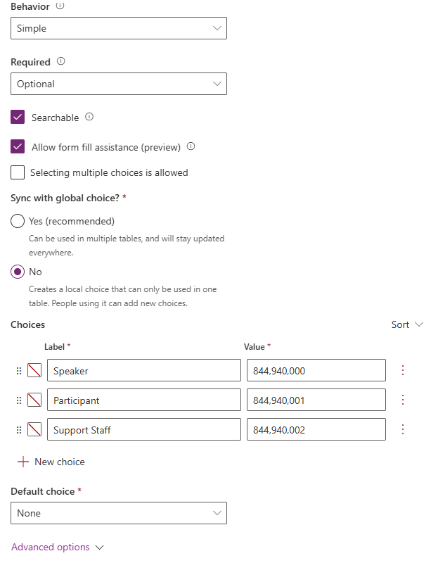

---
lab:
  title: Лаборатория 5. Создание приложения на основе модели
  learning path: 'Learning Path: Demonstrate the capabilities of Microsoft Power Apps'
  module: 'Module 3: Build a model-driven app'
---
## Цель обучения

В этом упражнении учащиеся будут создавать приложение на основе модели в Power Apps с помощью Copilot. Вы определите модель данных, измените формы и представления и создадите приложение.

**После успешного завершения этой лаборатории вы получите следующее:**

-   Создание приложения на основе модели.
-   Измените формы и представления в приложении в соответствии с вашими потребностями.
-   Перейдите к приложению на основе модели.

### Сценарий

Contoso Consulting — это профессиональная организация услуг, специализирующаяся на ИТ и консультационных службах искусственного интеллекта. В течение года они предлагают множество различных мероприятий своим клиентам. Некоторые из них являются торговыми шоу событий стиля, где у них есть много партнеров, и предоставляют подробные сведения о новых продуктах, тенденциях рынка и услугах. Другие происходят в течение года и являются быстрыми вебинарами, которые используются для предоставления сведений об отдельных продуктах.

Компания Contoso хотела бы использовать Power Platform для создания решения для управления событиями, которые они могут использовать для управления различными событиями, которые они размещают в течение года.

В этом упражнении вы собираетесь создать приложение на основе модели для управления событиями Contoso. Приложение на основе модели будет основано на существующей модели данных и будет включать события, сеансы событий и регистрации сеансов.

### Сведения о лаборатории:

Перед началом этого упражнения рекомендуется выполнить следующее:

-   **Лаборатория 2. Создание решения Power Platform**
-   **Лаборатория 3. Создание модели данных**

Предполагаемое время выполнения этого упражнения составляет **от 20 до 30** минут.

## Задача 1. Создание модели для поддержки нового приложения на основе модели

В настоящее время Contoso хранит контактные данные в своем экземпляре Dataverse, поэтому они хотели бы использовать Dataverse для отслеживания курсов и регистрации курсов. Необходимо создать необходимые таблицы для поддержки приложения и создать приложение на основе модели на основе этой модели данных.

1.  При необходимости откройте веб-браузер и перейдите на [портал Разработчика Power Apps](https://make.powerapps.com/) и войдите с помощью учетных данных учетной записи Майкрософт.
2.  С помощью навигации слева выберите **"Решения".**
3.  Откройте созданное **ранее решение для управления событиями** .
4.  На панели команд выберите **новое **\>** приложение на основе модели приложений**\>****.** **
5.  **Выберите раздел "Создать**".
    -   **Имя:** Управление событиями Contoso
    -   **Описание.** Используется для управления событиями и сеансами событий.
6.  Нажмите кнопку ****"Создать**".**
7.  Нажмите кнопку "Добавить страницу **" и выберите **таблицу **Dataverse.**
8.  Выберите следующие таблицы:
    -   Контакт
    -   Мероприятие
    -   Сеанс событий
    -   Регистрация сеанса
9.  Убедитесь, что **выбран параметр "Показать в навигации** ".

10. Нажмите кнопку **Добавить**.

> [!NOTE]
> Иногда вам будет предложено войти во время работы с конструктором. Выберите X, чтобы отменить выход из экрана входа.

## Задача 2. Изменение приложения на основе модели в соответствии с вашими потребностями

Теперь, когда приложение создано, мы будем вносить некоторые изменения в способ представления приложения. У нас есть две отдельные группы; Люди и события. Мы хотим иметь таблицу "Контакты" в группе "Люди" и все таблицы событий в группе "События".

1.  В области **навигации** слева от экрана нажмите кнопку **"Создать группу**".
2.  В правой части приложения разверните **панель свойств** .
3.  Измените **заголовок** с **новой группы** на **"Люди".**

    

4.  Выберите многоточие **** в **группе "Люди**".
5.  Выберите **новую группу**.
6.  **В области "Свойства"** измените имя группы из **новой группы** на **события.**
7.  Наведите указатель мыши на **представление** регистрации сеансов слева, выберите **многоточие** и выберите **"Переместить вниз** ", чтобы переместить **регистрации сеансов** в группу **событий** .
8.  Наведите указатель мыши на **представление сеансов** событий слева, выберите **многоточие** и выберите **"Переместить вниз** ", чтобы переместить **сеансы** событий в группу **событий** .
9.  Наведите указатель мыши на **представление "События" слева, выберите **многоточие** и выберите **"Переместить вниз**", чтобы переместить **события в группу ****"События****".

Приложение должно выглядеть следующим образом:

## Задача 3. Изменение различных форм и представлений в приложении на основе модели в соответствии с вашими потребностями.

Приложение на диске модели использует формы и представления для представления данных пользователям в пользовательском интерфейсе (пользовательский интерфейс). Мы будем вносить некоторые изменения в эти элементы.

1.  При необходимости убедитесь, что приложение **Contoso Event Management** открыто в конструкторе.
2.  В левой части экрана в **группе "Люди** " наведите указатель мыши на **форму** "Контакты" и нажмите кнопку **"Изменить".**

    Если вам будет предложено сохранить изменения, нажмите кнопку **"Сохранить и продолжить".**

3.  В разделе " **Столбцы** таблиц" слева выберите **новый столбец** таблицы.
4.  Настройте столбец таблицы следующим образом:
    -   **Отображаемое имя:** тип контакта
    -   **Тип данных:** выбор
    -   **Синхронизация с глобальным выбором:** Нет
5.  **Задайте метку** первого выбора **говорящего.**
6.  Выберите **+Создать выбор** и задайте метку участнику **.**
7.  Выберите **+Создать выбор** и установите метку в **службу поддержки**.

8.  Выберите кнопку **Сохранить**.
9.  С помощью мыши выберите **текст "Создать контакт"** , чтобы выбрать заголовок формы. *(Фиолетовый прямоугольник должен отображаться вокруг заголовка)*
10. В разделе "Столбцы** таблицы" в поле поиска** введите ****"Контакт**".**
11. **Выберите только что созданный столбец таблицы "Тип** контакта".
12. Теперь **тип контакта должен отображаться в заголовке****.**

13. На панели команд форм **нажмите кнопку **"Сохранить и опубликовать**".**
14. Нажмите кнопку со стрелкой "Назад"**, **чтобы вернуться в конструктор приложений на основе модели
15. В области **навигации** слева наведите указатель мыши на **представление** "Контакты" и щелкните **значок "Изменить** ".
16. Выберите **+Просмотреть столбец**.
17. Найдите и добавьте **столбец типа** контакта в форму.
18. Нажмите кнопку **"Сохранить и опубликовать** ".

Далее мы будем вносить необходимые изменения в остальные формы.

19.  В разделе **"Навигация"** выберите **"Представление** событий".

Обратите внимание, что может быть **столбец EventDetails1** . Если это так, мы собираемся удалить его из представления. *(Если у вас нет этого,* **Вы можете перейти к шагу 28***)*

20.  Наведите указатель мыши на **представление** "События" и нажмите кнопку **"Изменить** ".

Если появится запрос на сохранение изменений, нажмите кнопку ****"Сохранить" и продолжить**.**

21.  **В представлении** щелкните стрелку рядом с **EventDetails1** и в появившемся меню нажмите кнопку **"Удалить**".

22.  Нажмите кнопку **"Сохранить и опубликовать** ".
23.  Нажмите кнопку со стрелкой** "Назад", **чтобы вернуться в конструктор приложений.
24.  В разделе **"Навигация"** наведите указатель мыши на **форму** "События****" и выберите **"Изменить**".

    Если появится запрос на сохранение изменений, нажмите кнопку **Сохранить и продолжить**.

25.  Выберите **поле "Сведения о событии1"** и нажмите **клавишу DELETE** на клавиатуре.

Форма должна выглядеть следующим образом:

26.  Нажмите кнопку **"Сохранить и опубликовать** ".
27.  Нажмите кнопку со стрелкой** "Назад", **чтобы вернуться в конструктор приложений.

Если в форме не было поля EventDetail1, перейдите здесь.

28.  **На панели** команд приложения нажмите кнопку **"Сохранить и опубликовать**".
29.  Нажмите кнопку "Назад **", **чтобы вернуться на портал разработчика **** Power Apps.
30.  Выберите **"Вернуться к решениям** ", чтобы вернуться к главному **экрану Power Apps** .

## Задача 4. Тестирование нового приложения

Теперь, когда приложение на основе модели было создано, мы будем тестировать его функциональные возможности.

Сначала мы добавим пару контактов.

1.  С помощью навигации слева выберите **"Приложения**".
2.  Измените отображаемые приложения из **"Мои приложения** " на **"Все**".
3.  Наведите указатель мыши на созданное **приложение "Управление событиями** курса" и выберите **значок воспроизведения** .
4.  С помощью навигации слева выберите **"Контакты**".
5.  На панели команд нажмите кнопку **+Создать** .
6.  На экране "Новый контакт"** настройте следующее**:
    -   **Имя:** Сюзанна
    -   **Фамилия:** Диас.
    -   **Название задания:** инженер
7.  В заголовке формы щелкните стрелку вниз рядом с типом **** контакта.
8.  Задайте тип контакта говорящему******.**

9.  Нажмите кнопку "Сохранить **", **чтобы сохранить контакт и оставить его открытым.
10. Нажмите кнопку **+Создать**.
11. На экране "Новый контакт"** настройте следующее**:
    -   **Имя:** Эдгар
    -   **Фамилия:** Swenson
    -   **Название задания:** архитектор
12. В заголовке формы щелкните стрелку вниз рядом с типом **** контакта.
13. Задайте тип контакта участнику******.**
14. Нажмите кнопку **Сохранить и закрыть**.

Далее мы добавим новое событие.

15.  С помощью навигации слева выберите **"События**".
16.  На панели команд нажмите кнопку **+Создать** .
17.  На экране "Новое событие **" настройте следующее**:
    -   **Имя события:** конференция Spring.
    -   **Дата события:** завтрашний день.
    -   **Максимальное число участников:** 500
    -   **Сведения о событии:** Весна конференция для демонстрации новейших продуктов и услуг от наших поддерживаемых поставщиков.
    -   **Тип события:** Конференция
    -   **Расположение:** Сиэтл
    -   **Требуется регистрация:** да/true

18.  Нажмите кнопку **Сохранить и закрыть**.

Далее мы добавим новый сеанс для события.

19.  С помощью навигации слева выберите **сеансы** событий.
20.  Нажмите кнопку **+Создать**.
21.  **Настройте сеанс** событий следующим образом:
    -   **Имя сеанса:** ответственный ИИ
    -   **Дата сеанса:** завтрашная дата
    -   **Длительность:** 1,5 часа
    -   **Описание сеанса:** все новые решения ИИ отвечают за это. Мы обсудим проблемы.
    -   **Докладчик:** Сюзанна Диас
    -   **Событие:** Spring Conference

22.  Нажмите кнопку **Сохранить и закрыть**.

Наконец, мы создадим регистрацию** сеансов**.

23.  С помощью навигации слева выберите **"Регистрация сеансов".**
24.  На панели** команд нажмите кнопку ****+Создать**.
25.  Выполните регистрацию сеанса следующим образом:
    -   **Имя:** E, Регистрация Swenson.
    -   **Дата регистрации:** дата сегодняшнего дня
    -   **Участник:** Эдгар Свенсон
    -   **Сеанс:** Марк Джонс

26.  Выберите кнопку **Сохранить и закрыть**.
