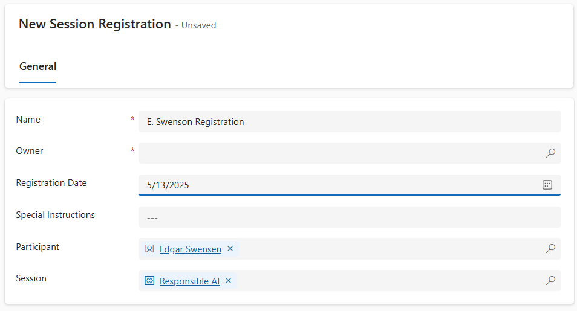

---
lab:
  title: Лаборатория 6. Создание потока Power Automate
  learning path: 'Learning Path: Demonstrate the capabilities of Microsoft Power Automate'
  module: 'Module 2: Build a Microsoft Power Automate flow'
---

## Цель обучения

В этом упражнении учащиеся создадут ряд различных облачных потоков с помощью Microsoft Copilot в Power Automate. Вы будете использовать различные методы создания, такие как Copilot и с нуля, чтобы ознакомиться с различными вариантами, доступными.

После успешного завершения этого упражнения вы будете:

- Использование запросов естественного языка для разработки рабочих процессов
- Настройка триггеров и действий
- Протестируйте автоматизацию для практического использования.

### Сценарий

Contoso Consulting — это профессиональная организация услуг, специализирующаяся на ИТ и консультационных службах искусственного интеллекта. В течение года они предлагают множество различных мероприятий своим клиентам. Некоторые из них являются торговыми шоу событий стиля, где у них есть много партнеров, и предоставляют подробные сведения о новых продуктах, тенденциях рынка и услугах. Другие происходят в течение года и являются быстрыми вебинарами, которые используются для предоставления сведений об отдельных продуктах. Кроме того, Компания Contoso начинает использовать автоматизированные агенты для оказания помощи клиентам с вопросами.

Компания Contoso хотела бы использовать Power Automate для создания потока подтверждения регистрации, который отправит автоматическое сообщение электронной почты клиенту при регистрации события. 

В этом упражнении вы собираетесь создать ряд потоков power Automate на основе определенных критериев.

Прежде чем начать это упражнение, необходимо выполнить следующие лаборатории:

- **Лаборатория 2. Создание модели данных**
- **Лаборатория 5. Создание приложения на основе модели**

## Упражнение 1. Создание потока уведомлений о регистрации сеансов

В этом первом упражнении вы собираетесь создать поток, который будет выполняться автоматически при создании новой регистрации сеанса. Он получит сведения о сеансе, событии и контакте, который зарегистрировал и отправит электронное сообщение электронной почты в него с их сведениями о регистрации.

### Задача 1. Создание потока

Мы хотим отправить подтверждение регистрации всем зарегистрированным пользователям. Мы создадим поток, который будет записывать сведения о регистрации и отправлять сообщение электронной почты подтверждения зарегистрированным пользователю.

1. Перейдите к [https://make.powerautomate.com](https://make.powerautomate.com/).

2. При необходимости повторной проверки подлинности нажмите **Войти** и следуйте указаниям на экране.

3. В правом верхнем углу экрана выберите среду **Dev One** (если она еще не выбрана). (Важно, не забудьте выполнить этот шаг.

4. В области навигации слева нажмите кнопку **"Создать**". (При появлении запроса выберите **** Начало работы.)

5. Нажмите **+ Создать поток**, а затем выберите **Автоматизированный облачный поток**.

6. Введите **уведомление** о регистрации для **имени** потока.

7. В разделе **Выбор триггера потока** найдите **Dataverse**.

8. Выберите триггер **При добавлении, изменении или удалении строки**, а затем нажмите **Создать**.

    Если вы видите ошибку недопустимых **параметров** , это связано с тем, что вы не прошли проверку подлинности. Выполните приведенные ниже действия, чтобы создать подключение. 
    - Выберите **"Изменить подключение**".
    - Нажмите кнопку **Добавить новую.*
    - **В поле "Имя подключения"** введите "Администратор** МОД**". Оставьте тип** проверки подлинности как **OAuth** и **выберите вход**.**
    - После входа перейдите к шагу **9.** 

9. Укажите условия триггера для потока, как показано ниже.

    - Выберите **Добавлено** для параметра **Тип изменения**
    - Выберите **"Регистрация сеансов** " для **имени таблицы.**
    - Выберите организацию для области на шаге триггера, выберите многоточие (**...**) и выберите **"Переименовать**".** **** ** 

10. Переименуйте шаг **триггера при добавлении регистрации сеанса.**

Это позволит вам и другим редакторам потока понять назначение шага без изучения подробностей.

### Задача 2. Создайте шаг, чтобы получить сведения о сеансе событий, для регистрации.

1. Выберите **+ Новый шаг**. 

2. Найдите строку по **идентификатору**. 

3. Выберите действие **Получить строку по ИД**.

4. Выбор **сеансов** событий в качестве **имени таблицы**

5. Выберите поле **Идентификатор строки**. Обратите внимание, что значки отображаются для выбора **динамического содержимого** или **выражений**.

6. **В поле "Идентификатор** строки" выберите **сеанс событий (значение)** из списка динамического содержимого****. На этом шаге вы ищете **сеанс** событий для регистрации** сеанса сеанса, созданного **для активации этого потока.

7. В действии **Выбрать строку по идентификатору** нажмите многоточие (**...**) и выберите **Переименовать**. Переименование этого действия **с получением сеанса событий**

Далее мы собираемся получить сведения о событии сеанса.

8. На шаге **"Получить сеанс** событий" выберите **+Вставить действие.**

9. Найдите строку по **идентификатору**. 

10. Выберите действие **Получить строку по ИД**.

11. Выбор **событий** в качестве **имени таблицы**

12. Выберите поле **Идентификатор строки**. Обратите внимание, что значки отображаются для выбора **динамического содержимого** или **выражений**.

13. **В поле "Идентификатор** строки" выберите **событие (значение)** из списка динамического содержимого****. На этом шаге вы ищете **событие** для **сеанса** событий, записанного на предыдущем шаге.

14. В действии **Выбрать строку по идентификатору** нажмите многоточие (**...**) и выберите **Переименовать**. Переименуйте это действие **, чтобы получить событие.**

Наконец, мы собираемся получить сведения о человеке, зарегистрированного для сеанса.

15. В разделе "Получение сведений о событии" установите флажок **"Вставить новое действие**".

16. В поле поиска введите **строку по идентификатору**.

17. Выберите " **Получить строку по идентификатору**".

18. Выберите **Контакты** в качестве **имени таблицы**

19. Выберите поле **Идентификатор строки**. Вы увидите, что откроется окно для выбора **Динамического содержимого** или **Выражений**.

20. **В поле "Идентификатор** строки" выберите **поле "Участник (значение")** из поля "Когда регистрация сеанса добавляется **" из **списка динамического **содержимого**.

21. Выберите строку по идентификатору **** и переименуйте это действие **, чтобы получить** **сведения** о участниках.

### Задача 3. Создание шага для отправки сообщения электронной почты для подтверждения регистрации сеанса

1. На шаге "Получить сведения о участнике **"** выберите **"Вставить новое действие**".

2. В поле поиска введите **"Отправить сообщение электронной почты**".

3. Щелкните элемент **Отправка электронной почты (V2)**.

Возможно, вам будет предложено создать подключение к Outlook, если это так, нажмите **кнопку входа** и войдите с помощью учетной **записи администратора** мода. 

4. Над полем **"To**" выберите значок Шестеренки****. В появившемся меню выберите **"Использовать динамическое содержимое**".

 

5. С помощью динамических значений в **поле "To" выберите **"Электронная** почта**" в разделе **"Получить сведения** о участнике".

6. **В поле "Тема"** убедитесь, что оно говорит подтверждение регистрации.

7. Введите приведенный ниже текст в поле **Текст сообщения**.

> **Примечание.** Динамическое содержимое должно размещаться, где поля именуются в квадратных скобках. Рекомендуется сначала скопировать и вставить весь текст, а затем добавить динамическое содержимое в нужные места.

  *Дорогой {Имя}, спасибо за регистрацию для предстоящего сеанса {Имя сеанса} в {Event Date}. {Динамик} будет вашим докладчиком в этом сеансе. Сеанс должен длиться {Длительность (часы)}. Ознакомьтесь с нашим другим сеансом на сайте {Event Name}.*

  *Всего хорошего*

  *Администрирование событий*
  
  *Специалисты компании Contoso*

Далее мы заменим текст в квадратных скобках элементами, описанными ниже.

8. Выделите текст **{Имя}**. Замените его полем **"Имя"** на шаге "Получить сведения** о участнике**".

9. Выделите текст {Имя сеанса **}** . Замените его полем "Имя сеанса **" на шаге **"Получить сеанс**** событий".

10. **Выделите текст {Event Date}**. Замените его полем **"Дата** события" на шаге **"Получить сведения о** событии".

11. **Выделите текст {Speaker}**. Замените его полем **докладчика (значение)** на шаге получения сеанса **** событий.

12. **Выделите текст {Длительность (часы)}**. Замените его полем **"Длительность (часы")** на шаге "Получение сеанса **** событий".

13. **Выделите текст {Event Name} (Имя события).** Замените его полем **"Имя** события" на шаге **"Получить сведения о** событии".

Завершенный шаг должен выглядеть следующим образом:

14. Выберите **Сохранить**.

Оставьте эту вкладку потока открытой для выполнения следующей задачи. Поток должен выглядеть примерно так:

### Задача 4. Ввод некоторых примеров данных

> **Примечание.** Если вы завершили лабораторию 5— создайте приложение на основе модели, можно пропустить эту задачу и перейти непосредственно к задаче 5. 

1. С помощью навигации слева выберите **"Приложения**".

2. Измените отображаемые приложения из **"Мои приложения** " на **"Все**".

3. Наведите указатель мыши на **приложение "Управление событиями** " и выберите **значок воспроизведения** .

4. С помощью навигации слева выберите **"Контакты**".

5. На панели команд нажмите кнопку **+Создать** .

6. На экране "Новый контакт"** настройте следующее**:

    - **Имя:** Сюзанна

    - **Фамилия:** Диаз

    - **Название задания:** инженер

7. В заголовке формы щелкните стрелку вниз рядом с типом **** контакта.

8. Задайте тип контакта говорящему******.**

9. Нажмите кнопку "Сохранить **", **чтобы сохранить контакт и оставить его открытым.

10. Нажмите кнопку **+Создать**.

11. На экране "Новый контакт"** настройте следующее**:

    - **Имя:** Эдгар

    - **Фамилия:** Swenson

    - **Название задания:** архитектор

    - **Электронная почта:** введите адрес электронной почты (ВАЖНО или поток не будет выполняться)

12. В заголовке формы щелкните стрелку вниз рядом с типом **** контакта.

13. Задайте тип контакта участнику******.**

14. Нажмите кнопку **Сохранить и закрыть**.

Далее мы добавим новое событие.

15. С помощью навигации слева выберите **"События**".

16. На панели команд нажмите кнопку **+Создать** .

17. На экране "Новое событие **" настройте следующее**:

    - **Имя события:** конференция Spring.

    - **Дата события:** завтрашний день.

    - **Максимальное число участников:** 500

    - **Сведения о событии:** Весна конференция для демонстрации новейших продуктов и услуг от наших поддерживаемых поставщиков.

    - **Тип события:** Конференция

    - **Расположение:** Сиэтл

    - **Требуется регистрация:** да/true

18. Нажмите кнопку **Сохранить и закрыть**.

Далее мы добавим новый сеанс для события.

19. С помощью навигации слева выберите **сеансы** событий.

20. Нажмите кнопку **+Создать**.

21. **Настройте сеанс** событий следующим образом:

    - **Имя сеанса:** ответственный ИИ

    - **Дата сеанса:** завтрашная дата

    - **Длительность:** 1,5 часа

    - **Описание сеанса:** все новые решения ИИ отвечают за это. Мы обсудим проблемы.

    - **Докладчик:** Сюзанна Диас

    - **Событие:** Spring Conference

22. Нажмите кнопку **Сохранить и закрыть**.

 
### Задача 5. Проверка и проверка потока

1. При необходимости откройте новую вкладку в браузере и перейдите к [https://make.powerapps.com](https://make.powerapps.com/)ней. 

2. В правом верхнем углу экрана выберите среду **Dev One** (если она еще не выбрана).

3. Выберите **"Приложения"** и откройте **приложение** "Управление событиями Contoso".

4. Оставив эту вкладку браузера открытой, вернитесь к предыдущей вкладке с вашим потоком.

5. В командной строке выберите **Тестирование**. Выберите **Вручную** и нажмите **Тестировать**.

6. Перейдите на вкладку браузера с открытым приложением на основе модели.

Наконец, мы создадим регистрацию** сеансов**.

7. С помощью навигации слева выберите **"Регистрация сеансов".**

8. На панели** команд нажмите кнопку ****+Создать**.

9. Выполните регистрацию сеанса следующим образом:

    - **Имя:** E, Регистрация Swenson.

    - **Дата регистрации:** дата сегодняшнего дня

    - **Участник:** Эдгар Свенсон

    - **Сеанс:** ответственный ИИ

10. Выберите кнопку **Сохранить и закрыть**.

11. Нажмите кнопку **Сохранить и закрыть**.

12. Перейдите на вкладку браузера, где запущено тестирование потока. После короткой задержки вы увидите выполнение потока. Здесь вы сможете обнаружить проблемы, если они возникнут в потоке, или подтвердить его успешное выполнение.

После короткой задержки вы увидите письмо в своей папке "Входящие".

> **Примечание**. Письмо может оказаться в папке нежелательной почты.
