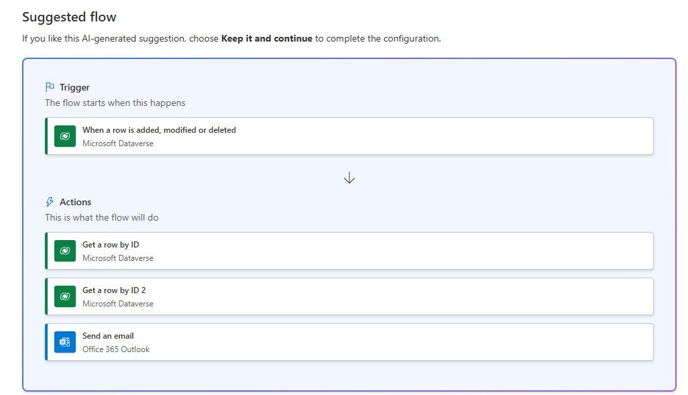

---
lab:
  title: Лаборатория 6. Создание потока Power Automate
  learning path: 'Learning Path: Demonstrate the capabilities of Microsoft Power Automate'
  module: 'Module 2: Build a Microsoft Power Automate flow'
---
## Цель обучения

В этом упражнении учащиеся создадут ряд различных облачных потоков с помощью Microsoft Copilot в Power Automate. Вы будете использовать различные методы создания, такие как Copilot и с нуля, чтобы ознакомиться с различными вариантами, доступными.

**После успешного завершения этого упражнения вы будете:**

- Использование запросов естественного языка для разработки рабочих процессов
- Настройка триггеров и действий
- Протестируйте автоматизацию для практического использования.

### Сценарий

Contoso Consulting — это профессиональная организация услуг, специализирующаяся на ИТ и консультационных службах искусственного интеллекта. В течение года они предлагают множество различных мероприятий своим клиентам. Некоторые из них являются торговыми шоу событий стиля, где у них есть много партнеров, и предоставляют подробные сведения о новых продуктах, тенденциях рынка и услугах. Другие происходят в течение года и являются быстрыми вебинарами, которые используются для предоставления сведений об отдельных продуктах. Кроме того, Компания Contoso начинает использовать автоматизированные агенты для оказания помощи клиентам с вопросами.

Компания Contoso хотела бы использовать Power Automate для создания потока подтверждения регистрации, который отправит автоматическое сообщение электронной почты клиенту при регистрации события. Кроме того, они хотят создать поток, который будет использовать ИИ для предоставления генеривных ответов на вопросы клиентов.

В этом упражнении вы собираетесь создать ряд потоков power Automate на основе определенных критериев.

Перед началом этого упражнения необходимо выполнить следующую лабораторию:

- **Лаборатория 3. Создание модели данных**
- **Лаборатория 5. Создание приложения на основе модели**

## Упражнение 1. Создание потока уведомлений о регистрации сеансов

В этом первом упражнении вы собираетесь создать поток, который будет выполняться автоматически при создании новой регистрации сеанса. Он получит сведения о сеансе, событии и контакте, который зарегистрировал и отправит электронное сообщение электронной почты в него с их сведениями о регистрации.

### Задача 1. Создание потока

Мы хотим отправить подтверждение регистрации всем зарегистрированным пользователям. Мы создадим поток, который будет записывать сведения о регистрации и отправлять сообщение электронной почты подтверждения зарегистрированным пользователю.

1.  Перейдите к <https://make.powerautomate.com>.
2.  При необходимости повторной проверки подлинности нажмите **Войти** и следуйте указаниям на экране.
3.  На экране "Создание службы автоматизации с помощью Copilot" введите *"При создании новой регистрации сеанса в Dataverse получите сведения о сеансе и событие, которое регистрация будет отправлять сообщение электронной почты с подтверждением зарегистрированному пользователю".*
4.  Copilot предложит потенциальный поток на основе вашего описания.
5.  Все должно выглядеть примерно так, как на изображении ниже.

6.  Нажмите кнопку **"Сохранить" и продолжить**.
7.  Проверьте подключения, чтобы убедиться, что все правильно.
8.  Выберите Создать поток.
9.  Выберите триггер **при добавлении, изменении или удалении** строки.
10. Укажите условия триггера для потока, как показано ниже.
    - Выберите **Добавлено** для параметра **Тип изменения**
    - Выбор **регистраций сеансов** для **имени таблицы**
    - Выберите значение **Организация** для параметра **Область**
11. Выделите текст **при добавлении, изменении или удалении** строки и переименовании шага **триггера при добавлении отчета о расходах.**

Это позволит вам и другим редакторам потока понять назначение шага без изучения подробностей.

### Задача 2. Создайте шаг, чтобы получить сведения о сеансе событий, для регистрации.

1.  Выберите " **Получить строку по идентификатору** ".
2.  Выбор **сеансов** событий в качестве **имени таблицы**
3.  Выберите поле **Идентификатор строки**. Вы увидите, что откроется окно для выбора **Динамического содержимого** или **Выражений**.
4.  **В поле "Идентификатор** строки" выберите **сеанс событий (значение)** из списка динамического содержимого****.
5.  Выберите строку по идентификатору **** и переименуйте это действие **, чтобы получить** **сеанс** событий.

Далее мы собираемся получить сведения о событии сеанса.

6.  Выберите " **Получить строку по идентификатору 2** ".
7.  Выбор **событий** в качестве **имени таблицы**
8.  Выберите поле **Идентификатор строки**. Вы увидите, что откроется окно для выбора **Динамического содержимого** или **Выражений**.
9.  **В поле "Идентификатор** строки" выберите **событие (значение)** из списка динамического содержимого****.
10.  Выберите строку по идентификатору **** и переименуйте это действие **Get** **Event**.

Наконец, мы собираемся получить сведения о человеке, зарегистрированного для сеанса.

11.  В разделе "Получение сведений о событии" установите флажок **"Вставить новое действие**".
12.  В поле поиска введите Dataverse.
13.  Выберите " **Получить строку по идентификатору**".
14.  Выберите **Контакты** в качестве **имени таблицы**
15.  Выберите поле **Идентификатор строки**. Вы увидите, что откроется окно для выбора **Динамического содержимого** или **Выражений**.
16.  **В поле "Идентификатор** строки" выберите **участника (значение)** из списка динамического содержимого****.
17.  Выберите строку по идентификатору **** и переименуйте это действие **, чтобы получить** **сведения** о участниках.

### Задача 3. Создание шага для отправки сообщения электронной почты для подтверждения регистрации сеанса

1.  Выберите шаг** отправки **электронной почты.
2.  Щелкните значок Шестеренки над полем ****"To"** и выберите **"Использовать** **динамические значения**".**
3.  **Выберите поле "To" и с помощью динамических значений выберите **"Электронная** почта**" в разделе "Получить сведения** о участнике**".
4.  **В поле "Тема"** убедитесь, что оно говорит подтверждение регистрации.
5.  Введите приведенный ниже текст в поле **Текст сообщения**.

> [!NOTE]
> Вместо полей, указанных в скобках, необходимо поместить динамическое содержимое. Рекомендуется сначала скопировать и вставить весь текст, а затем добавить динамическое содержимое в нужные места.

*Дорогой {Имя}, спасибо за регистрацию для предстоящего сеанса {Имя сеанса} в {Event Date}. Докладчик {Value} будет вашим докладчиком в этом сеансе. Сеанс должен длиться {Длительность (часы)}. Ознакомьтесь с нашим другим сеансом на сайте {Event Name}.*

*Всего хорошего*

*Администрирование событий*

*Специалисты компании Contoso*

6.  Выделите текст **{Имя}**. Замените его полем **"Имя"** на шаге "Получить сведения** о участнике**".
7.  Выделите текст {Имя сеанса **}** . Замените его полем "Имя сеанса **" на шаге **"Получить сеанс**** событий".
8.  **Выделите текст {Event Date}**. Замените его полем **"Дата** события" на шаге **"Получить сведения о** событии".
9.  **Выделите текст {Длительность (часы)}**. Замените его полем **"Длительность (часы")** на шаге "Получение сеанса **** событий".
10.  **Выделите текст {Event Name} (Имя события).** Замените его полем **"Имя** события" на шаге **"Получить сведения о** событии".

Завершенный шаг должен выглядеть следующим образом:

11.  Выберите **Сохранить**.

Оставьте эту вкладку потока открытой для выполнения следующей задачи. Поток должен выглядеть примерно так:

### Задача 4. Проверка и тестирование потока

1.  Откройте новую вкладку в браузере и перейдите к https://make.powerapps.com.
2.  В правом верхнем углу экрана выберите среду **Dev One** (если она еще не выбрана).
3.  Выберите **"Приложения"** и откройте **приложение** "Управление событиями Contoso".
4.  Оставив эту вкладку браузера открытой, вернитесь к предыдущей вкладке с вашим потоком.
5.  В командной строке выберите **Тестирование**. Выберите **Вручную** и нажмите **Тестировать**.
6.  Перейдите на вкладку браузера с открытым приложением на основе модели.
7.  С помощью навигации по карте сайта слева выберите **"Регистрация** сеанса".
8.  Нажмите кнопку **+Создать** , чтобы добавить новую **запись регистрации** сеанса.
9.  **Выполните запись** регистрации сеанса следующим образом:
    -   **Имя отчета:** Тестовый отчет
    -   **Назначение отчета:** конференция
    -   **Дата выполнения отчета:** завтра
10. Нажмите кнопку **Сохранить и закрыть**.
11. Перейдите на вкладку браузера, где запущено тестирование потока. После короткой задержки вы увидите выполнение потока. Здесь вы сможете обнаружить проблемы, если они возникнут в потоке, или подтвердить его успешное выполнение.

После короткой задержки вы увидите письмо в своей папке "Входящие".

> [!NOTE]
> Он может перейти в папку нежелательной почты.

## Упражнение 2. Создание потока устранения неполадок с технологией

### Задача 1. Создание потока устранения неполадок технологии

В этом упражнении вы создадите поток Power Automate, который будет выполняться с помощью агента, который будет записывать симптомы и использовать его для диагностики проблемы с технологией.

1.  Откройте [Power Automate**](https://make.powerautomate.com)**.****
2.  С помощью навигации слева нажмите кнопку **"Создать**".
3.  Выберите **автоматизированный поток облака.**
4.  Нажмите кнопку **"Пропустить** ".
5.  **Выберите поле "Добавить триггер**". Найдите и выберите **"Когда агент вызывает поток**".
6.  Выберите " **Добавить входные данные**".
7.  Выберите **текст** и измените имя ввода на** ****тип** устройства.
8.  Снова нажмите кнопку **"Добавить входные данные**", выберите **"Текст**" и измените его имя на ****** тип** проблемы.
9.  В последний раз выберите **"Добавить входные данные", выберите **"Текст**" и измените имя на "Входные данные****" на ****"Описание проблемы".**

Готовый триггер должен выглядеть следующим образом:

> [!IMPORTANT]
> Если бы мы создали технологию проверки симптомов true, мы зафиксируем несколько различных входных данных, чтобы помочь ответы, созданные как можно точнее. Для этого упражнения мы просто демонстрируем, как это сделать.

#### Указание действия

1.  В разделе " **Когда агент вызывает триггер потока** ", выберите **"Вставить новый шаг** " (+).
2.  В окне добавления действия найдите и выберите **команду "Выполнить запрос**".
3.  **В окне "Запуск запроса**" задайте **для поля **"Запрос**" значение "Сводка** ИИ".
4.  **В поле "Ввод текста**" щелкните **значок "Dynamics"** *(Молния болт).*
5.  В разделе "Когда агент вызывает поток", выберите следующие динамические значения:
    -   Тип устройства
    -   Тип проблемы
    -   Описание проблемы
6.  **В разделе "Запуск запроса**" выберите **"Вставить новый шаг" (+)**
7.  **В окне "Добавить действие**" введите "Ответ" и выберите **"Ответить агенту**".
8.  Выберите " **Добавить выходные данные**".
9.  Выберите **Текст**.
10. Задайте имя выходных данных **в значение "Сводный текст**".
11. **В поле "Ввод" введите значение для ответа с** помощью поля, выберите **динамическое значение** (световая болта)
12. Выполните поиск и выберите **Текст**.

Завершенный **ответ на шаг агента** должен выглядеть следующим образом:

13.  Выберите **Сохранить**.
14.  Нажмите кнопку **Тест**.
15.  В области тестового **потока** выберите **вручную**.
16.  Нажмите кнопку **Тест**.
17.  В области "Поток выполнения" введите следующее:
    - **Тип устройства:** Windows PC
    - **Тип проблемы:** неответственное приложение
    - **Описание проблемы.** При запуске Microsoft Excel приложение начнет загружаться, но заморозится сразу после экрана заставки Excel. Он просто сидит там, и ничего не происходит.
18.  Нажмите кнопку **"Запустить поток** ".
19.  После завершения теста выберите шаг "Выполнить запрос". Обратите внимание, что вернитесь на вкладку конструктора****.
20.  Выберите **Опубликовать**.
