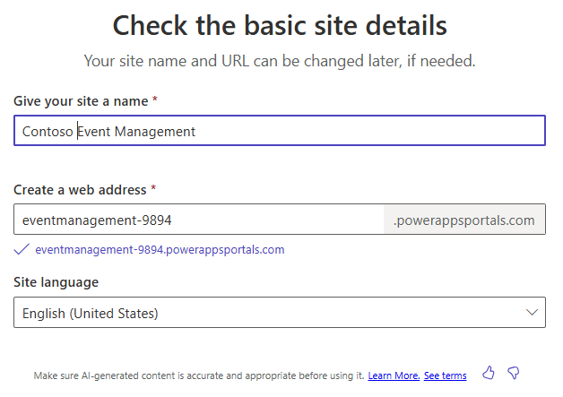

---
lab:
  title: Лаборатория 6. Создание сайта Power Pages
  learning path: 'Learning Path: Demonstrate the capabilities of Microsoft Power Pages'
  module: 'Module 2: Create a Microsoft Power Pages site'
---
## Цель обучения

В этом упражнении учащиеся будут использовать Copilot для создания сайта Power Pages. После создания сайта вы будете использовать Power Pages Design Studio для выполнения таких задач, как добавление и изменение содержимого, а также изменение тем.

### Сценарий

В течение всего года Компания Contoso Consulting размещает множество различных типов событий. Они варьируются от событий в человеке, до вебинаров, инструктор возглавлял тренировки и многое другое. Они хотят использовать Microsoft Power Platform для управления различными событиями, которые они ставят. Они хотят использовать Power Pages для создания сайта управления событиями, в котором будут отображаться различные события, которые они размещают.

После успешного завершения этого упражнения вы будете:

-   Используйте Copilot для создания веб-сайта управления событиями.
-   Добавьте новое содержимое на сайт.
-   Предварительный просмотр нового сайта Power Pages различных типов устройств.

**Сведения о лаборатории:**

Перед началом этого упражнения необходимо выполнить следующую лабораторию:

- **Лаборатория 2. Создание модели данных**

> **Важно.** Эта лаборатория использует ИИ для создания компонентов. Так как результаты ИИ могут отличаться, важно отметить, что результаты могут отличаться (но похожи на то, что определено в лаборатории). Основные понятия, описанные в лаборатории, будут одинаковыми независимо от того, что было создано или что оно было названо. Если таблицы и столбцы не совпадают точно, может потребоваться изменить параметры, созданные для вас.

Предполагаемое время выполнения этого упражнения составляет **от 30 до 45** минут.

**Прежде чем начать:** если вы впервые обращаетесь к порталу разработчика Power Pages, вам может потребоваться выполнить некоторые настройки.  В этом случае следуйте приведенным ниже инструкциям.  В противном случае можно продолжить **задачу 1.**  

1.  При необходимости перейдите к [Microsoft Power Pages](https://make.powerpages.microsoft.com).
1.  **На экране "Добро пожаловать в Power Pages"** нажмите кнопку **"Начало работы**".

    

1. На экране " **Расскажите нам немного о себе** ", нажмите кнопку **"Пропустить** ".

    

## Задача 1. Создание нового сайта Power pages с помощью Copilot.

1.  При необходимости перейдите к разделу <https://make.powerpages.microsoft.com>
1.  **На домашней странице студии** разработки Power Pages введите следующий текст: "*Создание сайта для управления событиями, размещенными в нашей организации".*
1.  Нажмите кнопку **Send** (Отправить).
1.  **На экране "Проверка основных сведений о** сайте" настройте следующее:
    - **Присвойте сайту имя:** `Contoso Event Management`
    - **Создание веб-адреса:** примите предоставленный по умолчанию адрес
    - **Язык сайта:** английский

    

1.  Нажмите кнопку **Далее**.
1.  **На экране выбора макета** просмотрите предлагаемый макет. Если вам нужны дополнительные варианты макета, нажмите кнопку **"Повторите попытку** ", чтобы **copilot** предложил другой макет.
1.  После определения шаблона, который вы хотите использовать, нажмите кнопку **"Далее".**
1.  **В разделе "Добавление общих страниц" выберите следующие страницы**:
    - О нас
    - Связаться с нами
    - Вопросы и ответы
    - Выберите все дополнительные страницы по мере необходимости.
1.  Выбрав страницы, нажмите кнопку **"Готово**".

    Новый сайт будет создан в фоновом режиме, который может занять несколько минут.

1.  После создания сайта откройте его (если оно еще не сделано).)

    > **Примечание.** Иногда при первом загрузке сайта может появиться сообщение о том, что объект Liquid не найден. В этом случае обновите окно браузера (F5), чтобы перезагрузить сайт. Должен появиться сайт.

## Задача 2. Изменение содержимого сайта

Теперь, когда создан исходный сайт, вы можете использовать студию конструктора для изменения сайта, добавив страницы, текст, изображения, формы и многое другое.

1.  **Главная навигация выберите **"Главная"****, чтобы открыть **домашнюю** страницу.
1.  Наведите указатель мыши на **текст сайта** управления событиями Contoso в заголовке сайта и выберите **"Изменить заголовок** сайта".
1.  Измените название** сайта на **** Contoso Consulting**.
1.  Нажмите кнопку **"Отправить изображение** ".
1.  **На экране "Добавить изображение" выберите **"Отправить изображение****", выберите **логотип** Contoso из файлов класса и нажмите кнопку **"Открыть**".
1.  Выбрав изображение логотипа **** Contoso, нажмите кнопку **"ОК**".
1.  После завершения изменений выберите **X** , чтобы оставить **экран заголовка** сайта "Изменить".
1.  Чтобы изменить фоновое изображение сайта, щелкните в любом месте фонового изображения.
1.  В появившемся меню выберите **"Изменить фон**".
1. Нажмите кнопку **"Изменить изображение** ".
1. Выберите **библиотеку** мультимедиа и нажмите кнопку **"Отправить изображение**".
1. **Выберите изображение Site_Background** из файлов класса и нажмите кнопку **"Открыть**".
1. Выбрав Site_Background, нажмите кнопку **"ОК**".
1. Выберите текст **"Добро пожаловать в события** Contoso" и измените текст на **Contoso Consulting**.
1. На появившемся панели инструментов нажмите кнопку **конструктора** *(кисть краски).*
1. Щелкните стрелку рядом со свойством Теневого **** текста и задайте для **смещения H-Offset **** значение 2**.
1. **Выберите X**, чтобы закрыть окно конструктора** **текста.
1. Выберите текст ниже Contoso Consulting *(может сказать что-то подобное вашему партнеру в управлении событиями)* и измените его на **вашего партнера на сегодня и завтра.**

    Теперь, когда мы внесли некоторые основные изменения на домашнюю страницу, мы будем обновлять тему сайта, чтобы лучше соответствовать фирменной символики Contoso.

1.  С помощью навигации слева нажмите кнопку **"Стилизация** ".
1.  Выберите тему Ярко-синего **** цвета.
1.  В разделе **"Цвета** бренда" выберите серый **** круг цвета.
1.  Изменение шестнадцатеричного **** цвета **: 101E2B**
1.  Нажмите **ОК**.
1.  Выберите белый** круг и измените **цвет на **шестнадцатеричный** код **e8e8e8e8**
1.  Выберите **ОК**
1.  Выберите черный** круг и измените **цвет **на Белый**. (ff)
1.  Нажмите **ОК**.
1. Внесите дополнительные изменения в них. Завершив изменение тем, нажмите кнопку **"Сохранить** ".

## Задача 3. Подключение сайта к бизнес-данным

Одним из основных преимуществ Power Pages является возможность подключения Power Pages к бизнес-данным, которые используются в Dataverse. Прежде чем мы можем перенести данные, необходимо создать некоторые элементы, которые будут использоваться.

1.  С помощью навигации слева выберите **значок данных** .
1.  **В поле поиска** введите **событие**.
1.  Выберите таблицу **События**.

    Сначала мы создадим форму, которая будет использоваться при добавлении нового события.

1.  Выберите вкладку "Формы", а затем нажмите кнопку ****+Создать форму**.**
1.  **Задайте имя `Create Event`** формы, а затем нажмите кнопку **"Создать**".
1.  Мы не будем вносить изменения в макет. Нажмите кнопку **"Сохранить и опубликовать** ".
1.  Нажмите стрелку **** назад, чтобы вернуться к конструктору.

    Далее мы создадим форму, которая будет использоваться для просмотра и редактирования существующих событий

1.  Нажмите кнопку **+Создать форму** .
1.  Назовите событие представления формы **и нажмите кнопку **"Создать**".**
1.  **На панели** команд выберите **"Добавить компонент**" и выберите **subgrid**.
1.  Настройте subgrid следующим образом:
    -   **Показать связанные записи:** Да
    -   **Таблица:** сеансы событий
    -   **По умолчанию:** активные сеансы
1.  Нажмите кнопку **Готово**.
1.  Нажмите кнопку **"Сохранить и опубликовать** ".
1.  Нажмите кнопку "Назад", **чтобы вернуться в Студию** конструктора**.**

## Задача 4. Создание необходимых форм веб-страниц

Теперь, когда мы определили формы для таблицы событий, мы создадим страницы, которые включают эти формы, чтобы пользователи сайта могли работать с записями событий. Мы создадим страницы для просмотра, создания и редактирования событий.

1.  С помощью навигации слева выберите **значок Pages** .
1.  Нажмите кнопку **+Page** .
1.  В **Copilot** введите следующий текст: **`Add a new blank page.`нажмите кнопку **"Отправить".**
1.  Нажмите кнопку **"Сохранить".**
1.  В верхней части новой страницы нажмите **кнопку "Добавить раздел** ".
1.  Выберите **1 столбец**.
1.  В **разделе "Выбор компонента", добавляемого в этот раздел**, выберите **"Форма**".
1.  Выберите **+ Создать форму**.
1.  **На экране "Добавление формы**" настройте следующее:
    - **Выбор таблицы:** Событие
    - **Выберите форму:** создание события
    - **Назовите копию выбранной формы:** создание события
1. Выберите вкладку **"Данные"** и убедитесь, что **для этой формы** задано **значение "Создать новую запись**".
1. Перейдите на вкладку **"Отправить".** **В поле отображения этого сообщения** введите *`Your event has been successfully submitted.`*
1. Выберите кнопку **ОК**.

    Давайте удалим дополнительные разделы на странице, так как им не нужны.

1. **Выберите раздел** под только что добавленной формой****. На появившемся панели инструментов нажмите кнопку "Дополнительно **" (...)** и нажмите кнопку **"Удалить**".
1. Повторите предыдущий шаг, чтобы удалить оставшиеся два раздела со страницы.

    После завершения все элементы, которые должны оставаться, являются созданной формой и нижним колонтитулов в нижней части страницы.

1. В разделе **"Главная навигация** слева" выберите многоточие рядом с созданной страницей **.**
1. В появившемся меню выберите **параметры страницы**.
1. Настройте параметры страницы следующим образом:
    - **Имя:** новое событие
    - **Частичный URL-адрес:** new-Events
1. Выберите кнопку **ОК**.

    Далее мы добавим дополнительную страницу, которую можно использовать для просмотра отдельного события.

1.  Убедитесь, что у вас по-прежнему выбраны **страницы** и нажмите кнопку **+Page** .
1.  В окне "**Описание страницы", чтобы создать ее**, введите: **`Add a Blank Page named View Event.`нажмите кнопку **"Отправить".**
1.  Нажмите кнопку "Сохранить"**, **чтобы принять новую страницу.
1.  В верхней части новой страницы нажмите **кнопку "Добавить раздел** ".
1.  Выберите **1 столбец**.
1.  В **разделе "Выбор компонента", добавляемого в этот раздел**, выберите **"Форма**".
1.  Выберите **+ Создать форму**.
1.  **На экране "Добавление формы**" настройте следующее:
    - **Выбор таблицы:** Событие
    - **Выберите форму:** просмотр события
    - **Назовите копию выбранной формы:** просмотр события
1.  Выберите вкладку "Данные **" и задайте **для поля формы** **значение "Только для чтения**".**
1. Выберите кнопку **ОК**.

    Давайте удалим дополнительные разделы на странице, так как им не нужны.

1. **Выберите раздел** под только что добавленной формой****. На появившемся панели инструментов нажмите кнопку "Дополнительно **" (...)** и нажмите кнопку **"Удалить**".
1. Повторите предыдущий шаг, чтобы удалить оставшийся раздел со страницы.
1. В разделе **"Главная навигация** слева" выберите **многоточие** рядом с созданной страницей.
1. В появившемся меню выберите **параметры страницы**.
1. Настройте параметры страницы следующим образом:
    - **Имя:** просмотр события
    - **Частичный URL-адрес:** просмотр событий
1. Выберите кнопку **ОК**.

    Наконец, создадим еще одну форму веб-страницы, которую можно использовать для редактирования события.

1.  Убедитесь, что у вас по-прежнему выбраны **страницы** и нажмите кнопку **+Page** .
1.  В окне "**Описание страницы", чтобы создать ее**, введите: **`Add a Blank Page named Edit Event.`нажмите кнопку **"Отправить".**
1.  Нажмите кнопку "Сохранить"**, **чтобы принять новую страницу.
1.  В верхней части новой страницы нажмите **кнопку "Добавить раздел** ".
1.  Выберите **1 столбец**.
1.  В **разделе "Выбор компонента", добавляемого в этот раздел**, выберите **"Форма**".
1.  Выберите **+ Создать форму**.
1.  **На экране "Добавление формы**" настройте следующее:
    - **Выбор таблицы:** Событие
    - **Выберите форму:** создание события
    - **Назовите копию выбранной формы:** изменение события
1.  Перейдите на вкладку "Данные **" и задайте **для этой формы** **значение "Обновить существующую запись**".**
1. Выберите кнопку **ОК**.

    Давайте удалим дополнительные разделы на странице, так как им не нужны.

1. **Выберите раздел** под только что добавленной формой****. На появившемся панели инструментов нажмите кнопку "Дополнительно **" (...)** и нажмите кнопку **"Удалить**".
1. Повторите предыдущий шаг, чтобы удалить оставшиеся разделы на странице.
1. Выберите кнопку **ОК**.

## Задача 5. Создание страницы, отображающей список событий

Теперь, когда мы определили необходимые формы, которые мы будем использовать для управления записями, мы создадим представление страницы для отображения этих записей.

1.  Нажмите кнопку **+Page** .

1.  В окне "**Описание страницы", чтобы создать ее**, введите: **`Add a blank page called events.`нажмите кнопку **"Отправить".**
1.  Нажмите кнопку **"Сохранить",** чтобы принять новую страницу.
1.  В верхней части новой страницы нажмите **кнопку "Добавить раздел** ".
1.  Выберите **1 столбец**.
1.  В **разделе "Выбор компонента", добавляемого в этот раздел**, нажмите **кнопку *"Дополнительно**" (...).* В группе подключенных **данных** выберите **"Список**".
1.  **На экране "Добавить список**" выберите вкладку **"Настройка**" и настройте следующее:
    - **Выбор таблицы:** событие
    - **Выберите представления данных:** активные события, неактивные события
    - **Имя, указанное в списке:** `Events`
1.  Перейдите на вкладку **"Действия"** и настройте следующее:
    - **Создайте новую запись: вкл.**
        - **Тип целевого объекта:** форма
        - **Форма:** создание события
        - **Отображаемая метка:** `Create New Event`
    - **Просмотр сведений: вкл.**
        - **Тип целевого объекта:** форма
        - **Форма:** просмотр события
        - **Отображаемая метка:** `See Event Details`
    - **Изменение записи: вкл.**
        - **Тип целевого объекта:** форма
        - **Форма:** изменение события
        - **Отображаемая метка:** `Edit Event`
1. Нажмите кнопку **Готово**.

## Задача 6. Обновление разрешений

Чтобы убедиться, что пользователи видят только данные, относящиеся к ним организации, могут указывать разрешения на таблицу. В этой задаче мы создадим очень основные разрешения, которые предоставляют доступ любому пользователю.

1.  В разделе **"Главная навигация"** выберите страницу **"События** ".
1.  **Выберите список событий** и нажмите кнопку **+Создать разрешение**.
1.  Настройте разрешение следующим образом:
    -   **Имя:** события
    -   **Таблица:** событие
    -   **Тип доступа:** глобальный доступ
1.  **Задайте разрешение** на **чтение**.
1.  Выберите "**Добавить роли**" и выберите **роли "Администраторы", **"Анонимные пользователи**"** и **"Прошедшие проверку подлинности".**
1.  Выберите кнопку **Сохранить**.
1.  Откроется экран, на **который отображаются данные, которые отображаются всеми** пользователями, нажмите кнопку **"Сохранить**".

    Давайте повторим этот процесс для страниц форм событий. Начнем со **страницы "Новое событие** "

1.  В разделе **"Главная навигация"** выберите страницу **"Создать событие** ".
1.  Нажмите кнопку **"Обновить разрешение** ".
1.  Настройте разрешение следующим образом:
    -   **Имя:** создание событий
    -   **Таблица:** событие
    -   **Тип доступа:** глобальный доступ
1.  **Задайте разрешение** на **чтение** и **создание**.
1.  Выберите "**Добавить роли**" и выберите **роли "Администраторы", **"Анонимные пользователи**"** и **"Прошедшие проверку подлинности".**
1.  Нажмите кнопку **"Сохранить" и снова нажмите кнопку **"** Сохранить**" на всплывающем экране.

    Затем мы установим для **экрана "Изменить событие** ".

1.  В разделе **"Главная навигация"** выберите страницу **"Изменить событие** ".
1.  Нажмите кнопку **"Обновить разрешение** ".
1.  Настройте разрешение следующим образом:
    -   **Имя:** создание событий
    -   **Таблица:** событие
    -   **Тип доступа:** глобальный доступ
1.  **Задайте разрешение** на **чтение** и **обновление**.
1.  Выберите "**Добавить роли**" и выберите **роли "Администраторы", **"Анонимные пользователи**"** и **"Прошедшие проверку подлинности".**
1.  Нажмите кнопку **"Сохранить" и снова нажмите кнопку **"** Сохранить**" на всплывающем экране.

## Задача 7. Обновление навигации по сайту

Теперь, когда у нас есть страницы и элементы отформатированы так, как мы хотим, мы будем соответствующим образом настраивать навигацию сайта.

1.  В разделе **"Главная навигация"** выберите многоточие** рядом **со страницей **"Событие**".

1.  В появившемся меню выберите **"Переместить вверх**".
1.  Повторите шаг до тех пор, пока страница "Событие **", расположенная **под страницей **"Контактная информация**".
1.  Убедитесь, **что страница "Новое событие** " находится непосредственно на **странице "События** ". *(Если нет, переместите страницу "Новое событие", пока не будет.)*
1.  **На странице "Новое событие**" нажмите кнопку **с многоточием**.
1.  В появившемся меню выберите **"Сделать эту подстраховку**".
1.  Выберите многоточие рядом с **представлением события** и выберите **"Переместить на другие страницы**".
1.  Выберите многоточие рядом с **событием редактирования** и выберите **"Переместить на другие страницы**".
1.  **На панели** команд нажмите кнопку **"Синхронизация**".

## Задача 8. Предварительный просмотр и уточнение сайта

После создания сайта необходимо просмотреть его, чтобы убедиться, что он соответствует вашим бизнес-потребностям и требованиям, чтобы определить необходимые уточнения. Сайты можно просмотреть в режиме "Рабочий стол" и "Мобильный"

1.  В студии конструктора нажмите кнопку " **Главная** страница".
1.  Щелкните **"Предварительный просмотр** " на панели команд.
1.  Выберите **рабочий стол** для предварительного просмотра сайта в браузере.
1.  При просмотре в **режиме рабочего стола** просмотрите следующие аспекты вашего сайта, например:
    -   Макет и навигация.
    -   Элементы фирменной символики, такие как цвета, шрифты и логотипы.
1.  Завершив тестирование сайта, закройте вкладку **** "Браузер", чтобы вернуться в редактор сайта.

    Затем мы предварительно просмотрим сайт, как он будет отображаться на мобильных устройствах.

1.  Снова нажмите кнопку предварительного **просмотра** .
1.  Сканируйте QR-код **, отображаемый **с помощью мобильного устройства.
1.  Сайт откроется на мобильном устройстве *(примечание. Возможно, вам будет предложено войти в систему, если укажите учетные данные для входа.)*
1.  Как и в режиме рабочего стола, просмотрите следующие аспекты вашего сайта, например:
    - Макет и навигация.
    - Элементы фирменной символики, такие как цвета, шрифты и логотипы.
1. После завершения тестирования закройте вкладку браузера, чтобы вернуться на сайт.

