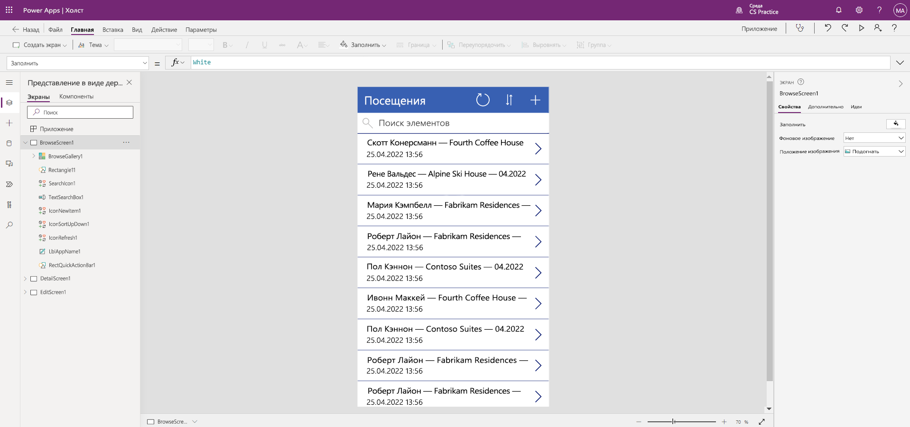

---
lab:
  title: Лабораторная работа 2. Создание приложение на основе холста
  module: 'Module 3: Get started with Power Apps'
ms.openlocfilehash: 24d99d14079d40f74a43ed0de64dd6ae5d7046c7
ms.sourcegitcommit: 0118c25a230425d0ccba16e6c3922053ee07c183
ms.translationtype: HT
ms.contentlocale: ru-RU
ms.lasthandoff: 05/06/2022
ms.locfileid: "144810924"
---
# Модуль 3. Начало работы с Power Apps
## Практическое занятие. Создание приложение на основе холста

# Сценарий

Bellows College — образовательное учреждение, имеющее на территории своего кампуса несколько зданий. Сейчас для регистрации посетителей кампуса используются бумажные журналы. Информация собирается несогласованно, отсутствуют средства сбора и анализа данных о визитах по всему кампусу.

В настоящее время администрация кампуса использует электронную таблицу Excel для отслеживания регистрации посетителей. Она хотела бы модернизировать систему регистрации посетителей таким образом, чтобы допуск в здания контролировали сотрудники службы безопасности, а обитатели кампуса предварительно регистрировали все визиты и обязательно записывали их.

В этом курсе обучения вы разработаете приложения и реализуете автоматические процедуры, позволяющие администрации и службе охраны Bellows College контролировать доступ в здания кампуса.

# Обзор этапов работы над общим заданием

Этапы разработки приложения на основе холста

-   Создание приложения на основе холста на основе данных из таблицы «Визит»

-   Настройка отображения визитов на экране обзора

-   Внесение ряда основных изменений в приложение

-   Тестирование функциональных возможностей приложения

## Предварительные требования

-   Выполнить **задание 0 модуля 0 «Проверка лабораторной среды»** .

# Упражнение \#1. Создание приложения «Визиты»

**Задача:** В этом упражнении вы создадите приложение на основе холста, подключив таблицу «Инициалы визитов», созданную ранее.

## Задача \#1. Создание приложения «Визиты»

1.  Перейдите к <https://make.powerapps.com>. При необходимости повторной аутентификации нажмите **Войти** и следуйте указаниям на экране.

2.  В правом верхнем углу экрана выберите свою среду **[ваши инициалы] практика** (если она еще не выбрана).

3.  При необходимости щелкните значок **Главная** в левой части экрана. В разделе **Начать с** выберите **Dataverse**.

4.  Выберите подключение к Dataverse. 

    >   **Примечание**. *Если подключение к Dataverse не существует:*
    >   -   Выберите **Создать подключение**.
    >   -   Найдите **Microsoft Dataverse**.
    >   -   Нажмите кнопку **Создать**.

5.  Найдите и выберите таблицу **Визиты**, созданную на предыдущем практическом занятии.

6.  Нажмите кнопку **Подключить** в правом нижнем углу.

7.  После создания приложения на экране приветствия в Power Apps Studio установите флажок **Больше не показывать** и щелкните **Пропустить**.

8.  После завершения создания приложение должно выглядеть примерно так, как показано ниже.

9. В конструкторе приложений нажмите кнопку **предварительного просмотра приложения** (значок воспроизведения) на панели команд. *(Вы также можете просмотреть приложение, нажав клавишу F5 на клавиатуре.)* Изучите, как выглядит ваше приложение в текущем варианте.

10. Закройте предварительный просмотр приложения, щелкнув символ **X** в правом верхнем углу экрана.

Поздравляем, вы успешно создали приложение Power App на основе данных из таблицы Dataverse. Следующим шагом в этом процессе является настройка приложения в соответствии с фирменной символикой колледжа. В следующей серии шагов вы узнаете, как выполнить дополнительную настройку приложения.

## Задача \#2. Изменение и созданного приложения и задание для него темы

В этой задаче вы настроите текст заголовка на каждом из трех экранов приложения (страницы обзора, сведений и изменения) и измените тему приложения.

1.  Вы находитесь на экране обзора. Выберите на экране метку **Визиты**.

3.  В правой части экрана на вкладке "Свойства" измените свойство элемента управления **Текст**, задав ему значение **Визиты Bellows College**.

4. В разделе свойств задайте свойству **Размер шрифта** значение **24**.

4.  Щелкните на пустом фоне, чтобы увидеть обновленный текст на экране обзора.

5.  Используя средства навигации в левой части экрана, выберите **DetailScreen1**.

5.  Выберите на экране метку **Визиты**.

6.  В правой части экрана на вкладке "Свойства" измените свойство элемента управления **Текст**, задав ему значение **Сведения о визитах**.

7.  Щелкните на пустом фоне, чтобы увидеть обновленный текст на экране подробностей.

8.  С помощью элементов навигации слева выберите **EditScreen1** (возможно, придется прокрутить представление в виде дерева вниз, чтобы найти этот элемент).

9.  Выберите на экране метку **Визиты**.

10.  В правой части экрана на вкладке свойств замените текст «Таблица 1» в свойстве элемента управления **Текст** на **Изменить сведения**.

11.  Щелкните на пустом участке фона, чтобы увидеть обновленный текст на экране редактирования.

12. Используя навигацию в левой части экрана, выберите **Экран обзора 1**.

13. На панели инструментов команд нажмите кнопку **Тема** и в появившемся списке выберите цвет темы — **Красный**.

## Задача \#3. Тестирование приложения «Визиты»

В этой задаче вы протестируете новое приложение.

1.  Открыв приложение в Конструкторе приложений, выберите **Файл**, измените имя приложения на **Приложение «Визиты»** и нажмите кнопку **Сохранить**.

2.  Нажмите на стрелку **Назад**, чтобы вернуться в приложение.

3.  Используя средства навигации в левой части экрана, выберите **BrowseScreen1**.

4.  В конструкторе приложений нажмите кнопку **предварительного просмотра приложения** (значок воспроизведения) на панели команд. *(Вы также можете просмотреть приложение, нажав клавишу F5 на клавиатуре.)*

4.  Когда приложение откроется, в поле **Поиск элементов** введите текст **Maria**
     *(обратите внимание, что элементы в фильтре коллекции зависят от вводимых данных в поле поиска).*

5.  Когда отобразится запись **Contoso Suites** для **Maria Campbell**, щелкните эту строку для перехода к странице сведений об этом визите. (**Примечание**. (*Если отображается несколько записей Contoso Suite Maria Campbell, выберите любую из них.* )

6.  Чтобы изменить запись, щелкните **значок карандаша** в правом верхнем углу приложения.

7.  Здесь вы можете изменить имя посещения, после чего нажать на "галочку" вверху справа. чтобы сохранить эти изменения.

8.  В правом верхнем углу экрана щелкните значок **X**, чтобы вернуться к хосту редактора приложения.

Поздравляем! Вы создали и настроили несложное приложение на основе холста.

# Сложности

-   Добавьте следующие столбцы в формы на экране сведений 1 и экране изменения 1: Фактическое начало, фактическое окончание, Запланированное начало и Запланированное окончание
