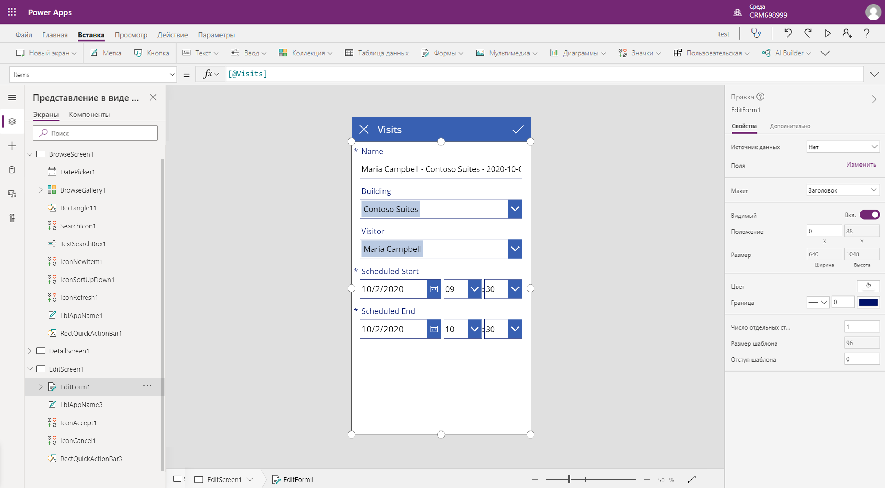
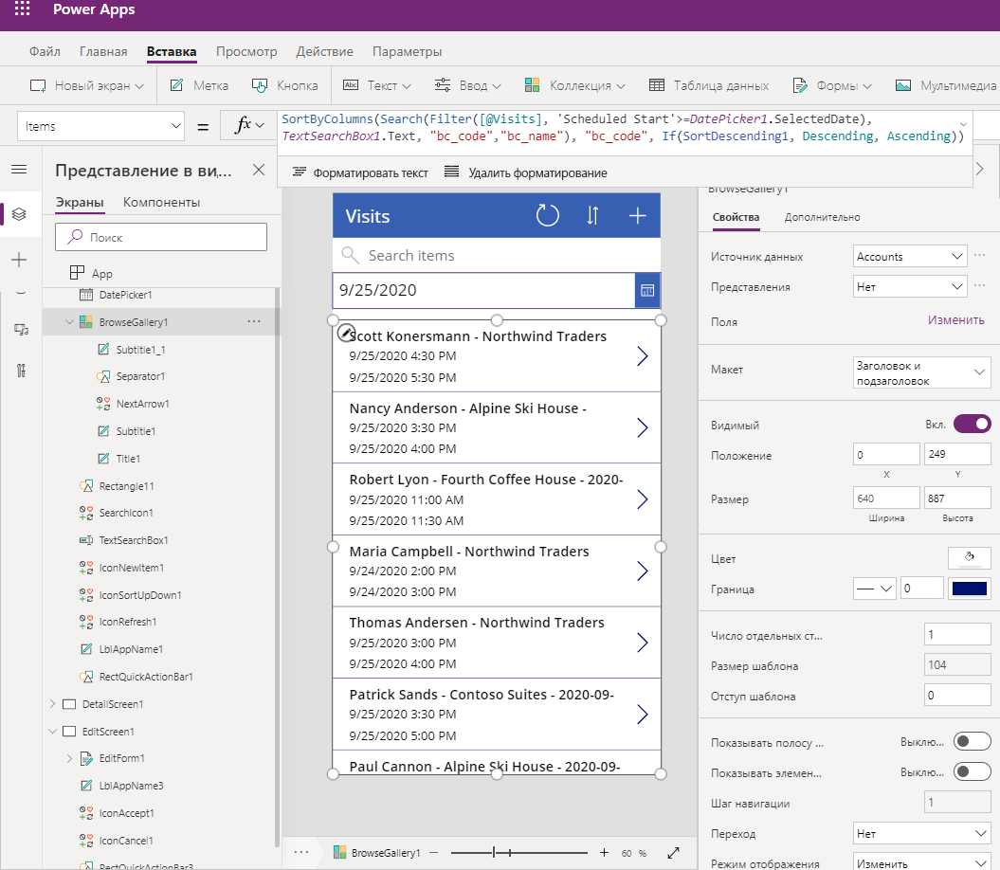

---
lab:
  title: Лабораторная работа 2. Как создать приложение на основе холста, часть 1
  module: 'Module 3: Get started with Power Apps'
ms.openlocfilehash: ac6cec75309098dae7715c0bdf42db75c9b80429
ms.sourcegitcommit: ef58c858463b890e923ef808b1d43405423943fd
ms.translationtype: HT
ms.contentlocale: ru-RU
ms.lasthandoff: 01/27/2022
ms.locfileid: "137899019"
---
# <a name="module-3-get-started-with-power-apps"></a>Модуль 3. Начало работы с Power Apps

## <a name="lab-how-to-build-a-canvas-app-part-1"></a>Практическое занятие. Как создать приложение на основе холста, часть 1

# <a name="scenario"></a>Сценарий

Bellows College — образовательное учреждение, имеющее на территории своего кампуса несколько зданий. Сейчас для регистрации посетителей кампуса используются бумажные журналы. Информация собирается несогласованно, отсутствуют средства сбора и анализа данных о визитах по всему кампусу. 

Администрация кампуса хотела бы модернизировать систему регистрации посетителей таким образом, чтобы допуск в здания контролировали сотрудники службы безопасности, а обитатели кампуса предварительно регистрировали все визиты и обязательно записывали их.

В этом курсе обучения вы разработаете приложения и реализуете автоматические процедуры, позволяющие администрации и службе охраны Bellows College контролировать доступ в здания кампуса.  

В первой части задания вы разработаете приложение Power Apps на основе холста, которое персонал колледжа сможет использовать для управления визитами посетителей.

# <a name="high-level-lab-steps"></a>Обзор этапов работы над общим заданием

Этапы разработки приложения на основе холста

-   создание приложения на основе данных с использованием шаблона в форм-факторе телефона;
-   настройка страницы с подробной информацией о визите;
-   настройка страницы редактирования визитов;
-   настройка коллекции для просмотра визитов;
-   добавление функции фильтрации источника данных коллекции для просмотра только будущих визитов.

## <a name="prerequisites"></a>Предварительные требования

* Выполнить **задание 0 модуля 0 «Проверка лабораторной среды»** .
* Выполнить **лабораторную работу 1 модуля 2 «Введение в Microsoft Dataverse»** .

## <a name="things-to-consider-before-you-begin"></a>Что необходимо знать перед началом работы?

-   Наиболее распространенный форм-фактор устройств для целевой аудитории
-   Предполагаемое количество записей в системе 
-   Способы уменьшения объема выборки записей, чтобы улучшить производительность приложения и удобство для пользователей

# <a name="exercise-1-create-staff-canvas-app"></a>Упражнение \#1. Создание приложения для персонала на основе холста

**Цель упражнения.** В этом упражнении вы создадите приложение на основе холста по шаблону, затем внесете изменения для включения обязательных данных.

## <a name="task-1-create-canvas-app"></a>Задача \#1. Создание приложения на основе холста

В этой задаче вы создадите приложение на основе холста в среде Microsoft Dataverse, используя шаблон-макет телефона. На основе таблицы «Визиты», выбранной из базы данных Dataverse, по шаблону будет создано приложение «Коллекция – Представление – Правка», предназначенное для управления визитами в кампус.

1.  Начните создание приложения на основе данных

    -   Выполните вход в <https://make.powerapps.com>

    -   В правом верхнем углу экрана выберите свою **среду**, если она еще не выбрана.

    -   На главном экране щелкните значок **Dataverse** в области **Начать с данных**.

2.  Подключитесь к таблице «Визиты»
    
    -   Выберите **+ Создать соединение**

    -   Выберите **Microsoft Dataverse** и щелкните **Создать**

    -   Найдите и выберите таблицу **Визиты**

    -   Щелкните **Подключиться**.

3.  Может появиться окно **Добро пожаловать в Power Apps Studio**. Нажмите **Пропустить**.

4.  Сохраните приложение.

    -   Выберите пункт меню **Файл \> Сохранить**.

    -   В качестве **имени приложения** введите текст «[Ваша фамилия]: персонал кампуса».

    -   Нажмите кнопку **Save**(Сохранить).

## <a name="task-2-configure-visits-detail-form"></a>Задача \#2. Настройка формы сведений о визите

В этой задаче вы настроите форму «Сведения» для просмотра информации об отдельных записях визитов.

1. Нажмите стрелку **Назад** в верхнем левом углу для возврата к определению приложения.

2. Разверните ветвь **DetailScreen1** в **представлении в виде дерева**.

3.  Выберите **DetailForm1**.

4.  На правой панели выберите команду **Изменить поля** в разделе **Поля**.

5.  Нажмите **Добавить поле**.

6.  Выберите следующие поля.

    * Фактическое окончание
    
    * Фактическое начало
    
    * Сборка 
    
    * Код
    
    * «Планируемое окончание».
    
    * Scheduled Start
    
    * Посетитель
    
7.  Нажмите кнопку **Добавить**

8.  Измените порядок полей в области **Поля**, перетаскивая имена полей мышью вверх или вниз. Рекомендуемый порядок полей:
    * «Код», «Имя», «Здание», «Посетитель», «Планируемое начало», «Планируемое окончание», «Фактическое начало», «Фактическое окончание».
    >**Совет.** Любое поле можно свернуть, щелкнув стрелку вниз рядом с именем поля.

9.  Удалите поле **Время создания**. Для этого щелкните многоточие ( **...** ) рядом с именем поля и выберите команду **Удалить**. 

10.  Закройте область **Поля**.
 
11.  Для сохранения выполняемой работы выберите команду **Сохранить** в меню **Файл**. Нажмите кнопку со стрелкой назад, чтобы вернуться к приложению.

## <a name="task-3-configure-visits-edit-form"></a>Задача \#3. Настройка формы редактирования визитов

В этой задаче вы настроите форму, предназначенную для редактирования информации об отдельных строках визитов.

1.  Разверните **EditScreen1** в **древовидном представлении**.

2.  Выберите **EditForm1**

3.  Выберите поле **Время создания** и нажмите клавишу **Del** для удаления этого поля.

4.  На панели свойств выберите раздел **Изменить поля**.

5.  Нажмите **Добавить поле**.

6.  Выберите следующие поля.

    * Сборка 
    
    * «Планируемое окончание».
    
    * Scheduled Start
    
    * Посетитель
    
7.  Нажмите кнопку **Добавить**

8.  Измените порядок полей в области **Поля**, перетаскивая имена полей мышью вверх или вниз. Рекомендуемый порядок полей:
    
    * «Имя», «Здание», «Посетитель», «Планируемое начало», «Планируемое окончание».
    >**Совет.** Любое поле можно свернуть, щелкнув стрелку вниз рядом с именем поля. 

9.  Закройте область **Поля**.

10.  Для сохранения выполняемой работы выберите команду **Сохранить** в меню **Файл**. Нажмите кнопку со стрелкой назад, чтобы вернуться к приложению.

Ваш экран должен выглядеть примерно так:



## <a name="task-4-configure-visits-gallery"></a>Задача \#4. Настройка коллекции визитов

В этой задаче вы настроите созданную ранее коллекцию на отображение заголовка, даты начала и даты окончания визита. 

1.  Разверните **BrowseScreen1** в **древовидном представлении**.

2.  Выберите **BrowseGallery1**

3.  Выберите свойство **TemplateSize** на правой панели «Расширенные свойства».

4.  Замените выражение на `Min(150, BrowseGallery1.Height - 60)`. Так мы получим достаточно места для дополнительной информации.

5.  В предварительной версии приложения выберите первое поле даты и времени в коллекции.

6.  В верхней области формулы замените строку **ThisItem."Время создания"** на `ThisItem.'Scheduled Start'`.

7.  Снова выберите поле.

8.  Нажмите клавиши **CTRL+C**, затем **CTRL+V** для создания копии поля.

9.  С помощью мыши или клавиатуры переместите скопированный элемент управления вниз и выровняйте его с остальными элементами управления в коллекции под другим полем даты и времени.

10.  В верхней области формулы замените строку **ThisItem."Планируемое начало"** на `ThisItem.'Scheduled End'`.

11.  Для сохранения выполняемой работы выберите команду **Сохранить** в меню **Файл**. Нажмите кнопку со стрелкой назад, чтобы вернуться к приложению.

## <a name="task-5-add-date-filter"></a>Задача 5. Добавление фильтра данных

Поскольку количество посещений непрерывно растет, пользователям нужна возможность фильтрации коллекции визитов. Например, пользователям может потребоваться просматривать только будущие визиты. В этой задаче вы добавите возможность просмотра визитов только после даты, выбираемой пользователем.

1. Выберите **BrowseScreen1**

2. Откройте меню **Вставка** в верхней части.

3. Нажмите **Ввод**, затем **Выбор даты**.

4. С помощью клавиатуры или мыши расположите элемент управления под полем поиска.

5. Выберите **BrowseGallery1** 

6. Измените размер и положение элемента управления коллекции так, чтобы он разместился под полем выбора даты и полностью занял экран. Это можно сделать, щелкнув значок изменения размера в верхней части элемента управления коллекции и изменив размер так, чтобы начало этого элемента расположилось под полем ввода даты.

7. Выбрав **BrowseGallery1**, откройте вкладку **Расширенные** в области свойств.

8. Найдите свойство **Элементы** и щелкните текстовое поле.

9. В выражении выберите **[@Visits]** и замените его на `Filter(Visits,'Scheduled End' >= DatePicker1.SelectedDate)`. Полное выражение должно выглядеть примерно так:

   ```
   SortByColumns(
    Search(
        Filter(
            Visits,
            'Scheduled End' >= DatePicker1.SelectedDate
           ),
           TextSearchBox1.Text,
        "bc_code","bc_name"
       ),
     "bc_scheduledstart",
     If(SortDescending1, Descending, Ascending)
   )
   ```
   
10. Для сохранения выполняемой работы выберите команду **Сохранить** в меню **Файл**. Нажмите кнопку со стрелкой назад, чтобы вернуться к приложению.

Ваш экран должен выглядеть примерно так:



# <a name="exercise-2-complete-the-app"></a>Упражнение 2. Завершение работы над приложением

В этом упражнении вы протестируете приложение и в случае положительного результата добавите приложение в свое решение.

## <a name="task-1-test-app"></a>Задача \#1. Тестирование приложения

1.  Запуск приложения

    -   Для предварительного просмотра приложения выберите **BrowseScreen1** и нажмите функциональную клавишу **F5**, либо щелкните значок **Воспроизвести** в правом верхнем углу.
    
    -   Приложение должно загрузить и вывести на экран список визитов. 
    
    -   Протестируйте фильтр, выбирая разные даты в соответствующем элементе управления.
    
    -   Выберите визит и проверьте правильность работы отображаемой формы.
    
    -   Вернитесь в коллекцию и нажмите **+** для создания нового визита. Проверьте наличие нужных столбцов в форме редактирования: «Посетитель», «Здание», «Планируемое начало» и «Планируемое окончание».
    
    -   Заполните информационные поля и подтвердите изменения. Убедитесь, что в коллекции появилась новая запись.
    
    -   Создайте еще не менее двух визитов.
    
    -   Чтобы закрыть окно предварительного просмотра, нажмите **ESC** или щелкните значок **X**.

2.  Сохраните и опубликуйте приложение.

    -   Выберите пункт меню **Файл** и нажмите **Сохранить** (если кнопка отображается).

    -   Нажмите кнопку **Опубликовать**.

    -   Нажмите **Опубликовать эту версию**.

    -   Нажмите кнопку со стрелкой **Назад**, чтобы вернуться к приложению.

    -   Закройте окно или вкладку браузера **Конструктор**.

    -   Если при попытке закрытия окна браузера появится запрос, нажмите **Выйти**.

## <a name="task-2-add-app-to-solution-and-publish"></a>Задача 2. Добавление приложения в решение и публикация 

1. Откройте приложение «Управление кампусом».

   * Выполните вход в <https://make.powerapps.com>
   
   * Если в верхней части экрана отображается среда, отличная от «Практика», выберите **свою среду**. 
   
   * Нажмите **Решения**.
   
   * Откройте свое решение **Управление кампусом**.
   
2. Выберите команду **Добавить существующее**, нажмите **Приложение**, затем **Приложение на основе холста**.

3. Выберите вкладку **За пределами Dataverse**.

4. Выберите свое приложение **Персонал кампуса** и нажмите **Добавить**.

5. Нажмите **Опубликовать все настройки**.

# <a name="challenges"></a>Сложности

* Календарное представление всех визитов и фильтрация по диапазону дат.
* Возможность создавать контакты и управлять ими в рамках приложения.
* Способ отображения нескольких собраний в течение одного визита.

