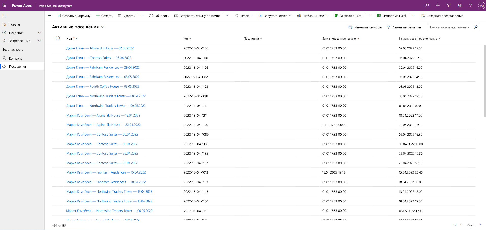

---
lab:
  title: Лабораторная работа 3. Создание приложения на основе модели
  module: 'Module 3: Get started with Power Apps'
---

# Лабораторная работа 3. Создание приложения на основе модели

**Клиенты WWL — условия использования** Если вам предоставляется клиент в рамках обучения под руководством инструктора, обратите внимание, что клиент предоставляется для поддержки практических лабораторий в обучении под руководством инструктора. Клиенты не должны совместно использоваться или использоваться для целей за пределами практических лабораторий. Клиент, используемый в этом курсе, является клиентом пробной версии и не может быть использован или доступен после окончания класса и не имеет права на расширение. Клиенты не должны быть преобразованы в платную подписку. Клиенты, полученные в рамках этого курса, остаются собственностью корпорации Майкрософт, и мы оставляем за собой право получить доступ и репозитории в любое время. 

## Сценарий

Bellows College — образовательное учреждение, имеющее на территории своего кампуса несколько зданий. Сейчас для регистрации посетителей кампуса используются бумажные журналы. Информация собирается несогласованно, отсутствуют средства сбора и анализа данных о визитах по всему кампусу.

Администрация кампуса хотела бы модернизировать систему регистрации посетителей таким образом, чтобы допуск в здания контролировали сотрудники службы безопасности, а обитатели кампуса предварительно регистрировали все визиты и обязательно записывали их.

В этом курсе обучения вы разработаете приложения и реализуете автоматические процедуры, позволяющие администрации и службе охраны Bellows College контролировать доступ в здания кампуса.

В этом задании вам предстоит создать приложение Power Apps на основе модели, чтобы обеспечить служебному персоналу возможность управлять записями о посещениях всего кампуса.

Обзор этапов работы над общим заданием

Создание приложение на основе модели состоит из следующих этапов:

- создание нового приложения на основе модели под названием "Управление Bellows Campus";

- редактирование элементов навигации приложения для связи с необходимыми таблицами;

- настройка форм и представлений таблиц, необходимых для приложения.

Мы будем работать со следующими компонентами.

- **Представления**: представления позволяют пользователю отображать существующие данные в табличной форме.

- **Формы**: здесь пользователь создает новые строки в таблицах или обновляет их.

Оба компонента интегрируются в приложение на основе модели, чтобы улучшить взаимодействие с пользователем.

Предварительные требования

- Выполнить **задание 0 модуля 0 «Проверка лабораторной среды»** .

- Выполнить **задание 1 модуля 2 "Моделирование данных"** .

Что необходимо знать перед началом работы?

- Какие изменения следует внести, чтобы улучшить взаимодействие с пользователем?

- Что необходимо включить в приложение на основе модели в зависимости от созданной нами модели данных?

- Как можно настроить карту сайта для приложения на основе модели?

Упражнение 1. Настройка представлений и форм

**Цель упражнения.** В этом упражнении вы настроите представления и формы для созданных ранее таблиц и сможете использовать их в приложении на основе модели.

Задача 1. Редактирование формы для визита

1. Войдите в [https://make.powerapps.com](https://make.powerapps.com/) (если это еще не сделано).

2. В правом верхнем углу экрана выберите свою среду **[ваши инициалы] практика** (если она еще не выбрана).

3. С помощью навигации слева выберите **Таблицы** и щелкните, чтобы открыть таблицу **Визит** .

Если таблица визитов не отображается, убедитесь, что вы находитесь в правильной среде (шаг 2).

4. В разделе **Возможности данных** выберите элемент **Формы** и щелкните форму "Сведения" с типом **Основная**, чтобы открыть ее. (**Важно!** Убедитесь, что выбран вариант с типом формы **Main**.) 

**ВАЖНО**. По умолчанию всем формам задано имя "Сведения", поэтому обязательно проверьте, что тип выбранной формы — **Основная**, а не какой-то другой. По умолчанию форма содержит два поля: "Имя" и "Владелец".

1. В правой части экрана в разделе свойств выберите поле **Отображаемое имя** и присвойте ему новое значение **Основные сведения**.

2. Выберите **Столбцы таблицы** в левой панели навигации и добавьте под полем **Владелец** следующие поля, перетаскивая столбцы в форму или просто щелкая заголовки столбцов:

    1. **Посетитель**

    2. **Scheduled Start**

    3. **Планируемое окончание**

    4. **Фактическое начало**

    5. **Фактическое окончание**

3. Перетащите столбец **Код** в заголовок формы.

Заголовок — это верхняя правая область формы. Возможно, вам придется свернуть панель свойств в правой части экрана, чтобы увидеть это поле в форме.

1. Не снимая выделения с поля **Код**, установите флажок **Только для чтения** на панели «Свойства» в правой части экрана.

2. Выберите поле **Владелец**. На панели свойств в поле **Метка** задайте значение **Узел**.

3. Нажмите кнопку **Сохранить и опубликовать** в правом верхнем углу и дождитесь завершения сохранения и публикации.

4. Если в новой вкладке или в новом окне браузера откроется представление редактирования, закройте его. В противном случае нажмите кнопку **Назад** в левом верхнем углу экрана. Теперь следует вернуться на вкладку форм для таблицы визитов.

5. Используйте навигацию в верхнем левом углу (Таблицы > Визит > Формы). Выберите **Визиты**, чтобы вернуться на главный экран таблицы **Визит**.

Задача 2. Изменение представления «Активные визиты»

В этой задаче мы изменим представление "Активные визиты" по умолчанию и создадим новое представление для визитов текущего дня.

1. В разделе **Возможности данных** выберите **Представления** и щелкните представление **Активные визиты**, чтобы открыть его.

2. Щелчком мыши или перетаскиванием добавьте в представление следующие поля:

    1. **Код**

    2. **Посетитель**

    3. **Scheduled Start**

    4. **Планируемое окончание**

3. Выберите столбец **Время создания** и нажмите **Удалить**. Поле **Время создания** будет удалено из представления.

4. Измените ширину отдельных столбцов, чтобы в них умещались данные.

5. В разделе **Сортировка по ...** Выберите X, чтобы удалить **Имя** , а затем выберите **Запланированный запуск**.

6. Выберите **Планируемое начало**, чтобы изменить порядок сортировки на **От самого нового к самому старому**.

7. Нажмите **Сохранить** и дождитесь сохранения изменений.

8. Нажмите **Опубликовать** и дождитесь завершения публикации.

Задача 3. Создание представления для визитов текущего дня

Теперь мы клонируем это представление, чтобы создать новое представление для визитов текущего дня.

ВАЖНО. Убедитесь, что представление "Активные визиты" осталось открытым, так как на его основе мы создадим представление для визитов текущего дня.

1. Нажмите **стрелку раскрывающегося списка** рядом с кнопкой «Сохранить» (будьте осторожны, не нажимайте саму кнопку) и выберите команду **Сохранить как**.

2. Измените имя на **Сегодняшние визиты** и нажмите **Сохранить**.

3. На панели свойств перейдите по ссылке **Изменить фильтры**.

4. Нажмите **Добавить** и выберите **Добавить строку**.

5. Выберите поле **Планируемое начало**, затем в раскрывающемся списке выберите условие **Сегодня**.

6. Щелкните **…** в строке **Состояние** и нажмите кнопку **Удалить**, чтобы удалить это условие фильтра.

7. Для сохранения условия нажмите **OK**. Теперь представление отфильтровано и будет отображать только записи, в которых дата начала запланирована на сегодня.

8. Добавьте в представление поля **Фактическое начало** и **Фактическое окончание**.

**Примечание**. Поскольку фильтр по состоянию представления не работает, мы увидим все сегодняшние визиты, в том числе завершенные. Эти поля помогут отделить завершенные визиты от текущих.

1. Нажмите **Сохранить** и дождитесь сохранения изменений.

2. Нажмите **Опубликовать** и дождитесь завершения публикации.

Упражнение 2. Создание приложения на основе модели

**Цель упражнения.** В этом упражнении вы создадите приложение на основе модели, настроите карту сайта и протестируете приложение.

Для простоты и экономии времени мы не будем рассматривать некоторые столбцы таблицы визитов в этом задании.

Задача 1. Создание приложения

1. Войдите в [https://make.powerapps.com](https://make.powerapps.com/) (если это еще не сделано).

2. В правом верхнем углу экрана выберите свою среду **[ваши инициалы] практика** (если она еще не выбрана).

3. При необходимости щелкните значок **Главная** в левой части экрана.

4. Создайте приложение на основе модели, выполнив приведенные ниже действия.

    1. Выберите **Пустое приложение** в разделе **Начать с** на начальном экране.

    2. В разделе **Пустое приложение на основе Dataverse** нажмите кнопку **Создать**.

    3. Введите **Управление Bellows Campus**  в качестве имени и нажмите кнопку **Создать**.

5. После загрузки нового приложения на основе модели нажмите кнопку **+ Добавить страницу**.

6. На экране **Добавление страницы** выберите **Таблица Dataverse** и нажмите кнопку **Далее** .

7. Добавьте следующие таблицы:

    1. Перейдите по адресу

    2. Contact

8. Выбрав 2 таблицы, нажмите кнопку **Добавить**.

9. Используя значки навигации в левой части экрана, выберите **Навигация**.

10. В области навигации выберите **Группа 1** под строкой навигации. Возможно, для этого понадобится развернуть меню слева.

11. В правой части экрана в разделе **Параметры отображения** присвойте свойству **Заголовок** новое значение **Безопасность**.

12. В области навигации в группе безопасности выберите **Подобласть 1**.

13. Щелкните **многоточие** и в появившемся меню выберите **Удалить подобласть 1**.

14. Нажмите **Сохранить** и дождитесь сохранения изменений.

15. После завершения **сохранения** нажмите кнопку **Опубликовать**, чтобы опубликовать изменения.

Задача 2. Тестирование приложения

1. Запуск приложения

    1. Нажмите кнопку **Воспроизвести**. Новое приложение загрузится на новой вкладке.

2. Создайте новый контакт.

    1. Приложение должно открыться в представлении **Мои активные контакты**. Если это не так, в области навигации слева щелкните "Контакты".

    2. В верхнем меню щелкните **+ Создать**.

    3. Укажите в поле **Имя** Александр, а в поле **Фамилия** — Демидов.

    4. В поле **Email** укажите свой личный адрес электронной почты. Он будет использоваться в одном из следующих заданий для получения сообщений электронной почты.

    5. Щелкните **Save &amp; Close** (Сохранить и закрыть).

    6. После этого созданный контакт должен отобразиться в представлении **Мои активные контакты**.

3. Создайте новый визит.

    1. Выберите **Визиты** в области навигации слева на карте сайта.

    2. Щелкните **+ Создать**.

    3. Введите следующие поля:

        1. **Имя**: Новый тестовый визит

        2. **Посетитель**: Выберите Александра Демидова

        3. **Запланированное начало**: выберите завтрашнее число и время начала 14:00

        4. **Запланированное окончание**: выберите завтрашнее число и время окончания 15:30

- Щелкните **Save &amp; Close** (Сохранить и закрыть). В результате будет создан визит, и вы должны увидеть его в представлении активных визитов.

- С помощью раскрывающегося списка рядом с полем **Активные визиты** измените представление на **Сегодняшние визиты**. В этом представлении новый визит отображаться не должен, так как он запланирован на завтра.

1. Вы можете добавить еще несколько тестовых записей.

Работающее приложение должно выглядеть примерно так:

Поздравляем! Вы создали и настроили несложное приложение на основе модели.

## Сложности

- Выбор конкретных представлений и форм для контактов.
