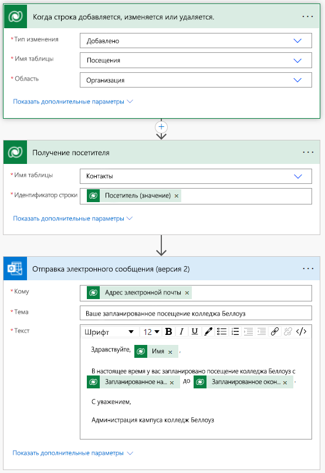

---
lab:
  title: "Задание\_4. Создание автоматизированного решения"
  module: 'Module 4: Get Started with Power Automate'
---

# Задание 4. Создание автоматизированного решения

**Арендаторы WWL: условия использования.** Если вам предоставляется арендатор в рамках обучения под руководством инструктора, обратите внимание, что арендатор предоставляется для поддержки практических занятий в ходе такого обучения. Арендаторы не должны использоваться совместно или для целей, выходящих за рамки практических занятий. Клиент, используемый в этом курсе, является пробным клиентом, его нельзя использовать или получить к нему доступ после окончания курса, и он не подлежит продлению. Клиентов нельзя переводить на платную подписку. Арендаторы, полученные в рамках этого курса, остаются собственностью корпорации Майкрософт, мы оставляем за собой право получить доступ к ним и вернуть их в любое время. 

## Сценарий

Bellows College — образовательная организация с несколькими зданиями на территории кампуса. Посетителей кампуса сейчас записывают в бумажные журналы. Информация не фиксируется последовательно, нет возможности, чтобы собрать и проанализировать данных о посещениях по всему кампусу.

Администрация кампуса хотела бы модернизировать систему регистрации посетителей таким образом, чтобы допуск в здания контролировали сотрудники службы безопасности, а обитатели кампуса предварительно регистрировали все визиты и обязательно записывали их.

На протяжении всего этого курса вы создадите приложения и выполните автоматизацию, чтобы позволить администрации Bellows College и сотрудникам службы безопасности контролировать доступ к зданиям на территории кампуса и управлять им.

В этом задании вы создадите поток Power Automate для отправки электронной почты посетителю при назначении визита.

## Основные пошаговые действия для выполнения задания

Ниже приведены требования, которые необходимо выполнить для завершения проекта.

- При назначении визита контактные лица должны получать уведомления по электронной почте.

## Необходимые компоненты

- Выполнить **задание 0 модуля 0 "Проверка лабораторной среды"**.
- Выполнить **задание 1 модуля 2 "Моделирование данных"**.
- Выполнить **задание 3 модуля 2 "Создание приложения на основе модели"**.
- Должен быть создан контакт «Джон Доу» с заполненным личным адресом электронной почты.

## Упражнение 1. Создание потока уведомлений о посещениях

**Цель.** В этом упражнении вы создадите поток Power Automate, реализующий соответствующее требование. Посетителю необходимо отправить электронное письмо с уникальным кодом, присвоенным визиту при создании.

### Задача \#1. Создание потока

1.  Перейдите на страницу `https://make.powerapps.com`.

2.  Возможно, потребуется повторно выполнить проверку подлинности, при необходимости нажмите кнопку **"Войти** " и следуйте инструкциям.

3.  **Выберите среду Dev One** в правом верхнем углу, если она еще не выбрана.

4.  В левой области навигации щелкните **Потоки**.

5.  При появлении запроса выберите **Начало работы**.

6.  Нажмите **+ Создать поток**, а затем выберите **Автоматизированный облачный поток**.

7.  Введите `Visit Notification` в качестве **имени потока**.

8.  В разделе **Выбор триггера потока** найдите `Dataverse`

9.  Выберите триггер **При добавлении, изменении или удалении строки**, а затем нажмите кнопку **Создать**.

10.  Укажите условия триггера для потока, как показано ниже.

    1.  Выберите **Добавлено** для параметра **Тип изменения**

    2.  Выберите значение **Визиты** для  параметра **Имя таблицы**

    3.  Выберите значение **Организация** для параметра **Область**

    4.  Для настройки шага триггера выберите многоточие (**...**), а затем нажмите **Переименовать**. Переименование шага триггера `When a Visit is added` 

        Это хорошая практика, позволяющая вам и другим редакторам потоков понять цель шага без необходимости погружаться в детали.

### Задача \#2. Создание шага для получения строки посетителя

1.  Выберите **+ Новый шаг**. На этом шаге будет получена информация о посетителе, включая адрес электронной почты.

2.  Найдите элемент `Dataverse`.

3.  Выберите действие **Получить строку по ИД**.

4.  Выберите **Контакты** в качестве **имени таблицы**

5.  Выберите поле **Идентификатор строки**. Вы увидите, что откроется окно для выбора **Динамического содержимого** или **Выражений**.

6.  В поле **Идентификатор строки** выберите **Посетитель (значение)** из списка **Динамического содержимого**. На этом шаге вы ищете контактное лицо для строки с информацией о визите, при создании которой был активирован этот поток. Так как адрес электронной почты находится в таблице контактов, вам нужно получить эту информацию для отправки посетителю сообщения электронной почты.

7.  В действии **Выбрать строку по идентификатору** нажмите многоточие (**...**) и выберите **Переименовать**. Переименование этого действия `Get the Visitor`
 
    Это хорошая практика, позволяющая вам и другим редакторам потоков понять цель шага без необходимости погружаться в детали.

### Задача \#3. Создание шага для отправки посетителю электронного письма

1.  Выберите **+ Новый шаг**. Это шаг предназначен для отправки посетителю электронного письма.

2.  Выполните поиск слова `mail`, выберите действие **Отправить сообщение электронной почты (V2)** в соединителе **Office 365 Outlook**.

3.  Если появится запрос на принятие условий использования этого действия, нажмите **Принять**.

4.  В поле **Кому** выберите **Добавить динамическое содержимое**. 
    
5.  Выберите значение **Электронная почта** из списка динамического содержимого.

    > Обратите внимание, что оно находится под заголовком **Получить посетителя**. Это означает, что вы выбираете адрес электронной почты, связанный с посетителем, которого вы искали на предыдущем шаге.

7.  В поле **Тема** введите `Your scheduled visit to Bellows College`

8.  Введите приведенный ниже текст в поле **Текст сообщения**.

    > Вместо полей, указанных в скобках, необходимо поместить динамическое содержимое. Рекомендуется сначала скопировать и вставить весь текст, а затем добавить динамическое содержимое в нужные места.

    ~~~~~~~~~~~~~~~~~~~~~~~~~~~~~~~~~~~~~~~~~~~~~~~~~~~~~~~~~~~~~~~~~~~~~~~~~~~~~~~~
    Dear {First Name},

    You are currently scheduled to visit Bellows Campus from {Scheduled Start} until {Scheduled End}.

    Best regards,

    Campus Administration
    Bellows College
    ~~~~~~~~~~~~~~~~~~~~~~~~~~~~~~~~~~~~~~~~~~~~~~~~~~~~~~~~~~~~~~~~~~~~~~~~~~~~~~~~

8.  Выделите текст **{Имя}**. Замените его значением поля **Имя** с шага **Получить посетителя**.

9.  Выделите текст **{Запланированное начало}**. Поместите сюда поле **Запланированное начало** из шага **При добавлении визита**.

10.  Выделите текст **{Запланированное окончание}**. Замените его полем **Запланированное окончание** из шага **При добавлении визита**.

11.  Выберите **Сохранить**.

Оставьте эту вкладку потока открытой для выполнения следующей задачи. Ваш поток должен выглядеть примерно так, как показано ниже.

### Задача \#4. Проверка и тестирование потока

1.  Откройте новую вкладку в браузере и перейдите по адресу `https://make.powerapps.com`.

2.  **Выберите среду Dev One** в правом верхнем углу, если она еще не выбрана.

3.  Выберите **Приложения** и откройте приложение **Управление кампусом Bellows**, созданное ранее на основе модели.

3.  Оставив эту вкладку браузера открытой, вернитесь к предыдущей вкладке с вашим потоком.

4.  В командной строке выберите **Тестирование**. Выберите **Вручную** и нажмите **Тестировать**.

5.  Перейдите на вкладку браузера с открытым приложением на основе модели. 

6.  Используя навигацию по карте сайта в левой части экрана, выберите **Визиты**.

6.  Нажмите кнопку **+ Создать**, чтобы добавить новую запись **Визит**.

7.  Заполните запись «Визит» следующим образом:

    -   **Имя**: `Test Visit`

    -   **Посетитель:** Джон Доу

    -   **Запланированное начало:** завтра в 8:00

    -   **Запланированное окончание:** завтра в 9:00

8.  Нажмите кнопку **Сохранить и закрыть**.

9.  Перейдите на вкладку браузера, где запущено тестирование потока. После короткой задержки вы увидите выполнение потока. Здесь вы сможете обнаружить проблемы, если они возникнут в потоке, или подтвердить его успешное выполнение.

    После короткой задержки вы увидите сообщение электронной почты в папке "Входящие", так как вы указали электронную почту Александра Демидова в качестве своей личной электронной почты. Обратите внимание, что письмо может оказаться в папке нежелательной почты.

## Задача

- Поэкспериментируйте с форматированием сообщения электронной почты. Как придать ему более профессиональный вид?

