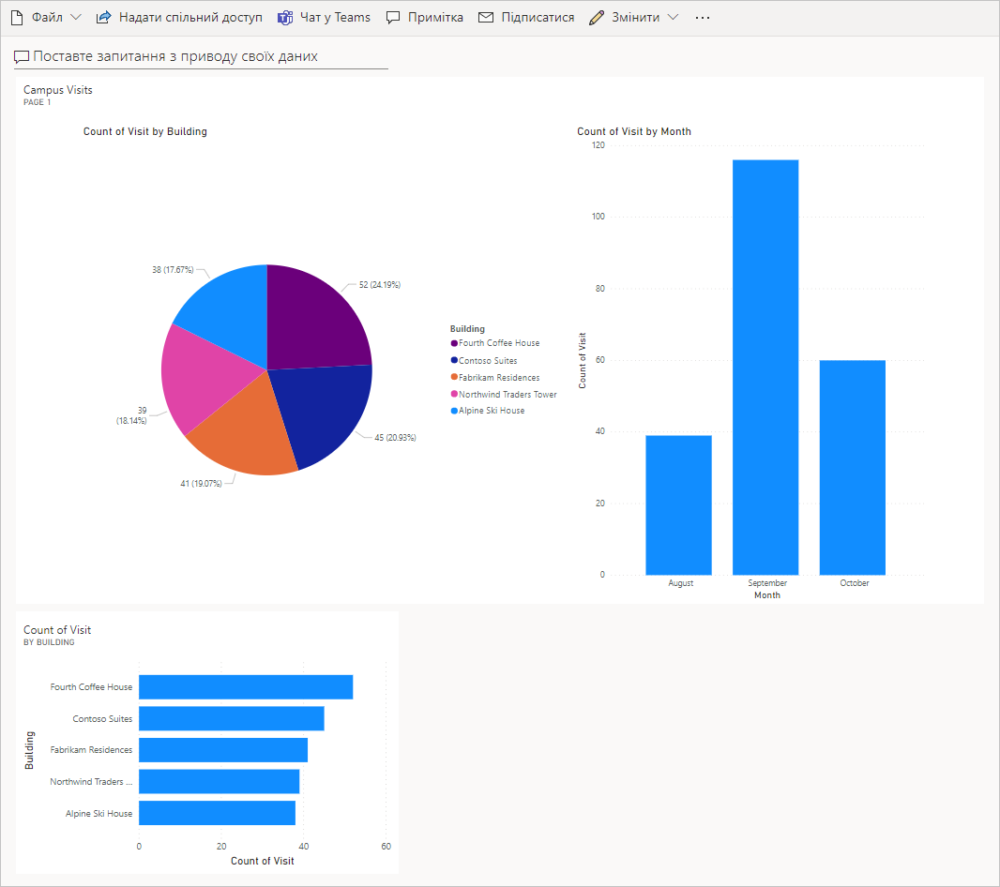

---
lab:
  title: Лабораторная работа 7. Создание простой панели мониторинга
  module: 'Module 5: Get Started with Power BI'
ms.openlocfilehash: b707cbf6b60af3b6d6a166565ccdeaeec844cb4a
ms.sourcegitcommit: fc79a9b68a8235b37fd90ef84ba8ae1aa2e581f5
ms.translationtype: HT
ms.contentlocale: ru-RU
ms.lasthandoff: 04/30/2022
ms.locfileid: "144424658"
---
# Модуль 5. Начало работы с Power BI
## Практическое занятие. Создание простой панели мониторинга

# Сценарий

Bellows College — образовательное учреждение, имеющее на территории своего кампуса несколько зданий. Сейчас для регистрации посетителей кампуса используются бумажные журналы. Информация собирается несогласованно, отсутствуют средства сбора и анализа данных о визитах по всему кампусу.

Администрация кампуса хотела бы модернизировать систему регистрации посетителей таким образом, чтобы допуск в здания контролировали сотрудники службы безопасности, а обитатели кампуса предварительно регистрировали все визиты и обязательно записывали их.

В этом курсе обучения вы разработаете приложения и реализуете автоматические процедуры, позволяющие администрации и службе охраны Bellows College контролировать доступ в здания кампуса.

В этом задании вы создадите панель мониторинга Power BI, показывающую данные о посещениях кампуса.

# Обзор этапов работы над общим заданием

Этапы разработки и создания панели мониторинга Power BI

-   Подключение к базе данных Dataverse.

-   Преобразование данных для включения удобных описаний связанных строк (поиск).

-   Создание и публикация отчета с различными способами визуализации сведений о посещениях кампуса.

-   Применение пользовательского запроса на естественном языке для создания дополнительных вариантов визуализации.

-   Создание мобильного представления панели мониторинга Power BI.

## Предварительные требования

-   Выполнить **задание 0 модуля 0 «Проверка лабораторной среды»** .

-   Выполнить **лабораторную работу 1 модуля 2 «Введение в Microsoft Dataverse»** .

## Что необходимо знать перед началом работы?

-   На какую аудиторию ориентирован отчет?

-   Как целевая аудитория будет просматривать отчет? На каком устройстве? Где?

-   Достаточно ли у вас данных для визуализации?

-   Какие характеристики можно использовать для анализа данных о посещениях?

# Упражнение \#1. Создание отчета в Power BI

**Задача:** В этом упражнении вы создадите отчет Power BI на основе данных электронной таблицы Excel, которые мы использовали в предыдущем упражнении.

## Задача \#1. Подготовка службы Power BI

1.  Загрузите [visits.pbix](../../Allfiles/visits.pbix) и сохраните на свой компьютер.

2.  При необходимости перейдите по адресу <https://app.powerbi.com/> и выполните вход.

3.  В левом нижнем углу экрана выберите **Получить данные**.

4.  Нажмите кнопку **Получить** в разделе **Файлы** в разделе **Создание содержимого**.

5.  Выберите **Локальный файл**.

6.  Найдите и выберите скачанный ранее файл **visit.pbix**.

7.  По завершении загрузки данных выберите отчет **Визиты** (обратите внимание, что в поле "Тип" задано значение **Отчет**).

8.  Нажмите кнопку **Изменить**. Если пункт меню **Правка** не отображается, нажмите **…** , затем выберите **Правка**.

Теперь служба Power BI настроена для использования при выполнении заданий. 

## Задача \#2. Создание диаграмм и визуализаций с привязкой ко времени

1.  Чтобы вставить диаграмму, нажмите значок **круговой диаграммы** на панели **Визуализации**.

2.  Нажмите стрелку раскрывающегося списка рядом с **bc_Building** в области «Поля». Перетащите поле **Здание** в поле **Условные обозначения**.

3.  Нажмите стрелку раскрывающегося списка рядом с **bc_Visit** в области «Поля». Перетащите поле **Визит** в целевое поле **Значения**.

4.  Используя угловые маркеры, измените размер круговой диаграммы, чтобы были видны все ее компоненты.

5.  Щелкните отчет за пределами круговой диаграммы, чтобы отменить ее выбор, и выберите гистограмму с накоплением в области **Визуализации**.

6.  Нажмите стрелку раскрывающегося списка рядом с **bc_Visit** в области «Поля». Перетащите поле **Визит** в целевое поле **Значения**.

7.  Перетащите поле **Начало** в целевое поле **Ось**.

8.  В области «Визуализации» щелкните **X** рядом с полями **Год** и **Квартал**, чтобы оставить для оси только итоговые значения **Месяц** и **День**.

9.  Используя угловые маркеры, измените размер диаграммы.

10. Протестируйте интерактивность отчета следующим образом.

    1.  Выделите на круговой диаграмме сегменты различных зданий и наблюдайте изменения в отчете по времени.

    2.  Щелкните гистограмму. Нажмите стрелку вниз, чтобы включить режим **Детализация**, затем щелкните столбец для перехода к следующему уровню (дням). 
    
    3.  Чтобы наблюдать изменения круговой диаграммы, переходите по уровням вверх и вниз, выбирая различные столбцы временной гистограммы.

11. Чтобы сохранить работу, щелкните **Сохранить**.

# Упражнение \#2. Создание панели мониторинга в Power BI

## Задача \#1. Создание панели мониторинга в Power BI

1.  У вас должен быть открыт отчет из предыдущей задачи.

2.  В меню выберите **Закрепить на панели мониторинга**. В зависимости от макета может потребоваться нажать **…** , чтобы отобразить дополнительные элементы меню.

3.  В ответ на подсказку **Закрепить на панели мониторинга** ведите **Новая панель мониторинга**.

4.  В поле **Имя панели мониторинга** введите **Управление кампусом** и нажмите **Закрепить динамическую страницу**.

5.  Выберите в верхней части экрана **Моя рабочая область**, затем выберите панель мониторинга **[Ваша фамилия]: управление кампусом**.

6.  Появится всплывающее окно, информирующее о созданной панели мониторинга. Выберите **Перейти к панели мониторинга**.

7.  Протестируйте интерактивность отображаемых круговых и линейчатых диаграмм.

## Задача \#2. Добавление визуализаций с использованием естественного языка

1.  В верхней части панели мониторинга **Управление кампусом** выберите поле **Задать вопрос о своих данных**.

2.  В области вопросов и ответов введите строку **здания по количеству визитов**. Отобразится гистограмма.

3.  Выберите **Закрепить визуальный элемент**.

4.  Выберите вариант **Существующая панель мониторинга**, затем выберите свою панель мониторинга **Управление кампусом** и нажмите **Закрепить**.

5.  Нажмите **Выйти из раздела вопросов и ответов**.

Должна отображаться панель мониторинга **Управление кампусом** с тремя визуальными элементами. Возможно, потребуется прокрутить экран вниз, чтобы отобразился новый визуальный элемент «Вопросы и ответы».

Ваша панель мониторинга должна выглядеть примерно так:

